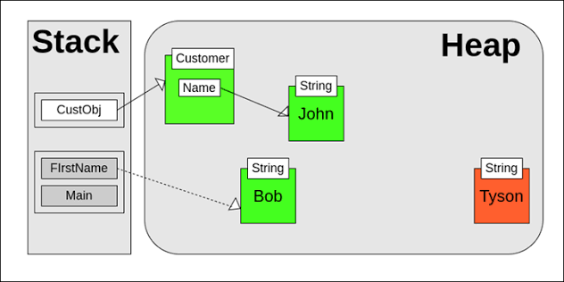

# Java Memory Model: Stack vs. Heap

In the Java Virtual Machine (JVM), runtime memory is primarily divided into two main areas: **Stack Memory** and **Heap Space**. Understanding how these memory regions operate and interact is fundamental to writing efficient, bug-free, and high-performance Java applications.



---

## 1. Stack Memory

**Stack Memory** is used for thread execution and managing short-lived data. Each time a thread is created, the JVM allocates a dedicated Stack for it.

### Key Characteristics

- **LIFO Structure:** Operates on a **Last-In, First-Out** (LIFO) basis using frames. Each method call creates a new **Stack Frame**.
- **Thread Safety:** Because each thread has its own private stack, data stored on the stack is inherently **thread-safe** and inaccessible to other threads.
- **Automatic Lifecycle:** Memory allocation and deallocation happen automatically as methods are called and returned. When a method finishes executing, its stack frame is immediately popped off the stack and freed.
- **Stored Elements:**
  - Primitive local variables (`int`, `double`, `boolean`, etc.).
  - References (pointers/addresses) to objects stored in Heap memory.

---

## 2. Heap Space

**Heap Space** is the runtime data area where memory for all class instances and arrays is dynamically allocated.

### Key Characteristics

- **Global Access:** Shared across all threads in the application.
- **Thread Sync Required:** Because Heap objects are shared globally, access to mutable heap data must be synchronized to avoid concurrency issues.
- **Garbage Collection:** Memory management is handled automatically by the **Garbage Collector (GC)**. Objects that no longer have active references pointing to them are marked for deletion.
- **Stored Elements:**
  - All objects instantiated using the `new` keyword.
  - Instance variables (fields belonging to an object).
  - Arrays.

---

## 3. Comparative Summary

| Feature           | Stack Memory                                | Heap Space                                   |
| :---------------- | :------------------------------------------ | :------------------------------------------- |
| **Primary Role**  | Method execution and short-lived local data | Object storage and dynamic memory allocation |
| **Scope**         | Thread-private (one stack per thread)       | Global (shared across all threads)           |
| **Thread Safety** | Thread-safe by design                       | Requires explicit synchronization for safety |
| **Lifetime**      | Short-lived (duration of method execution)  | Long-lived (persists until cleaned by GC)    |
| **Access Speed**  | Fast (direct memory address access)         | Slower (requires dereferencing pointers)     |
| **Size Limit**    | Small, fixed default size per thread        | Larger, dynamic, configurable via JVM flags  |
| **Error Types**   | `java.lang.StackOverflowError`              | `java.lang.OutOfMemoryError`                 |

---

## 4. Code Walkthrough & Memory Allocation

To visualize how Stack and Heap interact during execution, consider the following Java snippet:

```java
public class MemoryDemo {

    public static void main(String[] args) {
        int id = 101;                       // Line 1
        String name = "Java";               // Line 2
        Person user = new Person(id, name); // Line 3
        processUser(user);                  // Line 4
    }

    private static void processUser(Person p) {
        p.setActive(true);                 // Line 5
    }
}
```

### Execution Flow:

1. **Line 1 (`int id = 101`):**
   - The primitive value `101` is stored directly inside the `main()` frame on the **Stack**.

2. **Line 2 (`String name = "Java"`):**
   - The reference variable `name` is pushed onto the **Stack**.
   - The actual `String` object containing `"Java"` is placed in the **Heap** (specifically within the String Pool).

3. **Line 3 (`Person user = new Person(...)`):**
   - The `new Person(...)` object is instantiated in **Heap Space**.
   - The variable `user` sits on the **Stack**, holding a memory address (reference) that points to the `Person` object on the Heap.

4. **Line 4 & 5 (`processUser(user)`):**
   - Calling `processUser` creates a new frame on top of the **Stack**.
   - A copy of the reference pointer `p` is passed to the new stack frame, pointing to the exact same `Person` object in the **Heap**.

5. **Method Completion:**
   - Once `processUser` finishes, its stack frame is removed.
   - When `main()` exits, its stack frame is popped. With no references remaining, the `Person` object in the Heap becomes eligible for **Garbage Collection**.

---

## 5. Common Memory Errors

### `java.lang.StackOverflowError`

- **Cause:** Occurs when the Stack runs out of space, usually due to infinite recursion or excessively deep method call chains.
- **Solution:** Fix recursive exit conditions or increase stack size using the `-Xss` JVM option (e.g., `-Xss2m`).

### `java.lang.OutOfMemoryError: Java heap space`

- **Cause:** Occurs when the Heap runs out of memory because objects are being created faster than the Garbage Collector can reclaim them (or due to memory leaks holding object references unnecessarily).
- **Solution:** Eliminate memory leaks, optimize object creation, or increase heap size using the `-Xmx` JVM option (e.g., `-Xmx4g`).
