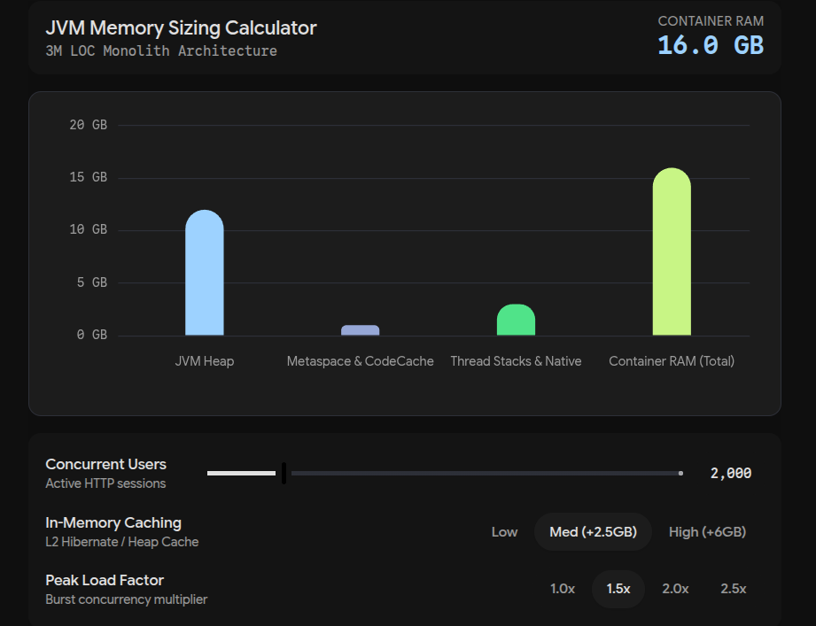

For a typical **enterprise-grade Java monolith of 3 million lines**, you are dealing with a massive codebase containing thousands of classes, extensive Spring/Hibernate bean graphs, and complex routing. In production, this typically translates to an **8 GB to 24 GB JVM Heap**, running inside a container with **16 GB to 32 GB+ of total RAM**.

## Core Memory Breakdown for a 3M LOC Monolith

When sizing your JVM and container, you must account for both heap and non-heap memory:

- **JVM Heap (`-Xms` and `-Xmx`):**
- **Light / Low Traffic:** 8 GB
- **Standard Enterprise Production:** 12 GB – 16 GB
- **Heavy Caching / High Concurrency:** 24 GB – 32 GB
- _Note:_ Heaps above 32 GB lose compressed object pointers (CompressedOops), which increases memory overhead per object. If you need more than 32 GB, consider moving to 48 GB+ or breaking up the monolith.

- **Metaspace & Code Cache:** A 3M LOC codebase loads thousands of classes and generates substantial JIT-compiled native code. Allocate **512 MB to 1.5 GB** for Metaspace (`-XX:MaxMetaspaceSize`) and at least **256 MB to 512 MB** for Code Cache (`-XX:ReservedCodeCacheSize`).
- **Thread Stacks:** Each active thread allocates native memory for its call stack (typically 1 MB by default). Under heavy concurrency (e.g., 1,000 to 2,000 simultaneous request threads), thread stacks consume 1 GB to 2 GB of off-heap memory.
- **Container Headroom:** Your container memory limit must be **30% to 50% higher than your maximum heap (`-Xmx`)** to prevent Out-Of-Memory (OOM) killer terminations caused by off-heap allocations, native libraries, garbage collection overhead, and direct byte buffers.

---

## Key Recommendations for Production

1. **Set Initial and Maximum Heap Equal (`-Xms` equals `-Xmx`):** For large monoliths, dynamic heap resizing introduces unnecessary GC pauses and CPU overhead in production. Pin them to the same value.
2. **Choose the Right Garbage Collector:**

- **G1GC:** The default and reliable choice for heaps between 8 GB and 32 GB.
- **ZGC or Shenandoah:** Highly recommended if your heap exceeds 16 GB and you require ultra-low pause times (under 10 milliseconds) for real-time APIs.

3. **Audit Your Bean Graph and Caches:** A common memory leak source in 3M LOC monoliths is unbounded in-memory caches (e.g., static maps or unevicted Guava/Caffeine caches). Implement strict size limits and TTLs.

## Thread stack

what is a thread stack?

A **thread stack** is a dedicated region of memory allocated to an individual thread within a process to manage its execution state. It serves as a private storage area for **local variables**, **function parameters**, and **return addresses**, ensuring that each thread can execute independently without interfering with others.

### Key Characteristics

- **Isolation**: While threads within the same process share the heap, code, and global data, **each thread has its own stack**. This prevents function calls from one thread from corrupting the local state of another.
- **LIFO Structure**: The stack operates on a Last-In-First-Out basis, growing downward as functions are called (pushing stack frames) and shrinking as they return (popping frames).
- **Memory Allocation**: The stack size is typically fixed at thread creation (e.g., **1 MB** on Windows, **8 MB** on Linux, and **1 MB** default in many JVMs). If a thread exceeds this limit, it triggers a **stack overflow**.
- **Context Switching**: The stack holds the thread's local context, allowing the operating system to pause and resume the thread by restoring its register set and stack pointer.

In summary, the thread stack is the **per-thread execution workspace** that maintains the flow of control and local data for a specific thread of execution.
