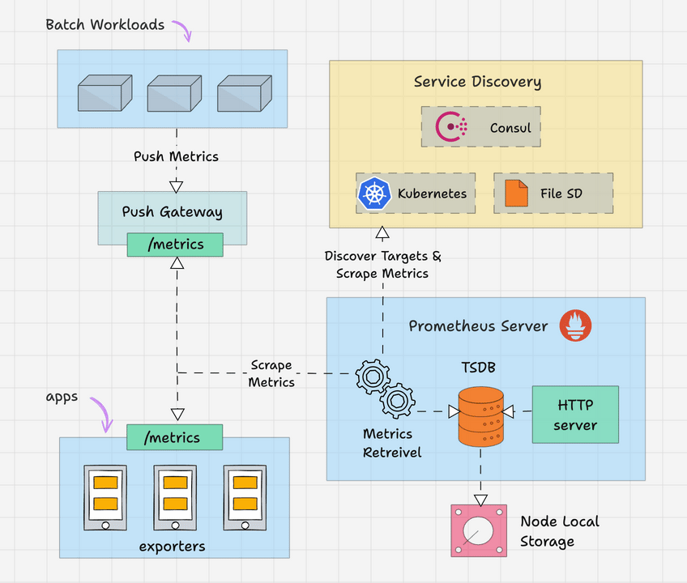
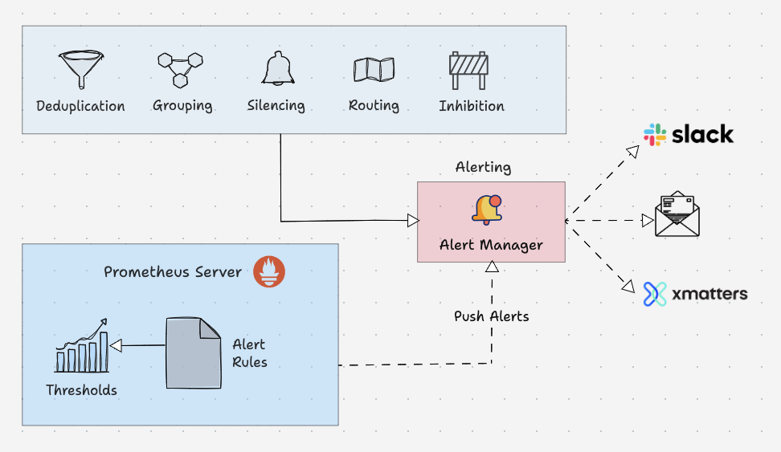

https://devopscube.com/prometheus-architecture/#prometheus-alert-manager

# Prometheus: Core Concepts, Best Practices, and Practical Examples

Prometheus is an open-source monitoring and alerting toolkit designed specifically for reliability, scalability, and cloud-native microservice architectures. Originally built at SoundCloud, it is now a graduated project under the Cloud Native Computing Foundation (CNCF).




---

## 1. Core Architecture & Concepts

### The Metric Data Model

Prometheus stores all data as **time series**—streams of timestamped values belonging to the same metric and set of labeled dimensions.

$$\text{Format: } \texttt{metric\_name\{label\_key="label\_value"\} value [timestamp]}$$

- **Metric Name:** Describes the general feature being measured (e.g., `http_requests_total`).
- **Labels:** Key-value pairs that allow multi-dimensional filtering, grouping, and aggregation (e.g., `{method="POST", handler="/login", status="200"}`).

### Architecture & Components

1. **Prometheus Server:** Scrapes and stores time-series data, evaluates alerting rules, and handles queries via PromQL.
2. **Pull Model:** Prometheus actively pulls (scrapes) metrics over HTTP endpoints (like `/metrics`) at set intervals, rather than relying on apps to push data.
3. **Exporters:** Third-party translators that convert metrics from legacy or un-instrumented systems (e.g., MySQL, Redis, OS Node Exporter) into Prometheus-compatible format.
4. **Pushgateway:** An intermediary for short-lived batch jobs that cannot be scraped directly before terminating.
5. **Alertmanager:** Deduplicates, groups, and routes alerts generated by the server to notification channels (Slack, PagerDuty, Email).

---

## 2. Metric Types

Prometheus defines four core metric types:

| Metric Type   | Description                                                               | Best For                                                    | Behavior                                                           |
| :------------ | :------------------------------------------------------------------------ | :---------------------------------------------------------- | :----------------------------------------------------------------- |
| **Counter**   | Cumulative metric that only increases or resets to zero on restart.       | Total HTTP requests, errors, jobs completed.                | Use with `rate()` or `increase()` in PromQL.                       |
| **Gauge**     | A single numerical value that goes up and down over time.                 | Memory usage, CPU usage, active worker connections.         | Use directly or with `avg_over_time()`.                            |
| **Histogram** | Samples observations (like durations or sizes) into configurable buckets. | Request latencies, payload sizes.                           | Calculates quantiles via `histogram_quantile()`.                   |
| **Summary**   | Calculates configurable quantiles over a sliding time window client-side. | Exact target percentiles when bucket tuning isn't feasible. | Higher performance cost on client; hard to aggregate across nodes. |

---

## 3. PromQL & Practical Query Examples

PromQL (Prometheus Query Language) allows real-time aggregation and mathematical operations across metrics.

### Example 1: Request Rate (Using `rate()`)

Calculate the per-second rate of HTTP requests over the last 5 minutes:

```promql
rate(http_requests_total{job="api-server"}[5m])
```

### Example 2: Error Rate Percentage

Calculate the ratio of 5xx HTTP errors against total requests:

```promql
(sum(rate(http_requests_total{status=~"5.."}[5m]))
/
sum(rate(http_requests_total[5m]))) * 100
```

### Example 3: 95th Percentile Latency

Determine the latency under which 95% of users experience response times:

```promql
histogram_quantile(0.95, sum(rate(http_request_duration_seconds_bucket[5m])) by (le))
```

### Example 4: Disk Memory Usage Percentage

Calculate available RAM percentage using Gauge metrics from `node_exporter`:

```promql
(1 - (node_memory_MemAvailable_bytes / node_memory_MemTotal_bytes)) * 100
```

---

## 4. Practical Implementation: Configuration & Alerting Rules

### Example Prometheus Configuration (`prometheus.yml`)

```yaml
global:
  scrape_interval: 15s
  evaluation_interval: 15s

rule_files:
  - "alert_rules.yml"

scrape_configs:
  - job_name: "prometheus"
    static_configs:
      - targets: ["localhost:9090"]

  - job_name: "api_service"
    scrape_interval: 5s
    static_configs:
      - targets: ["api-service.production.svc:8080"]
```

### Example Alerting Rule (`alert_rules.yml`)

```yaml
groups:
  - name: api_alerts
    rules:
      - alert: HighErrorRate
        expr: (sum(rate(http_requests_total{status=~"5.."}[5m])) / sum(rate(http_requests_total[5m]))) * 100 > 5
        for: 2m
        labels:
          severity: critical
        annotations:
          summary: "High HTTP 5xx error rate detected"
          description: "API server error rate is {{ $value }}% over the last 5 minutes."
```

---

## 5. Engineering Best Practices

### Avoid High Cardinality

- **The Problem:** Cardinality is the total number of unique time series produced by multiplying every label's unique values.
- **The Rule:** Never use unbounded values as labels—such as **User IDs, IP addresses, email addresses, UUIDs, or timestamp strings**. Doing so can crash the database or slow down PromQL evaluation.

### Standard Naming Conventions

- **Use suffixes for units:** Use base units and explicitly state them in the metric name (e.g., `_seconds`, `_bytes`, `_total` for counters).
- **Use prefix for app/domain:** E.g., `http_requests_total` or `process_cpu_seconds_total`.

### Monitor the "Four Golden Signals"

Structure metrics and dashboards around:

1. **Latency:** Time taken to serve a request.
2. **Traffic:** System demand (e.g., requests per second).
3. **Errors:** Rate of failing requests.
4. **Saturation:** Resource utilization and capacity limits (e.g., CPU, memory, thread pools).

### Alert on Symptoms, Not Causes

Alert when user-facing service degrades (e.g., "High 5xx error rate" or "High 99th percentile latency"), rather than low-level noise (e.g., "CPU spiked to 90% for 30 seconds"). Use alerting rules combined with Alertmanager for proper threshold durations (`for: 5m`).
