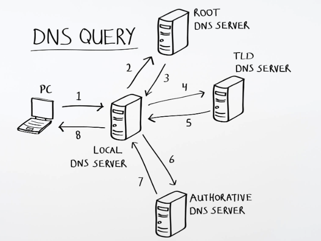

# DNS



## 1. How DNS Works (In Simple Words)

DNS (**Domain Name System**) is essentially the **phonebook of the internet**.

Humans remember names like `google.com` or `wikipedia.org`, but computers communicate using numbers called **IP addresses** (e.g., `142.250.190.46`). DNS translates human-friendly web addresses into machine-friendly IP addresses that browsers need to load web pages.

### Step-by-Step Resolution Process

When you type a URL into your browser, DNS follows a quick 4-step chain behind the scenes:

1. **Check the Memory (Cache):** Your computer first checks if it already saved the IP address from a recent visit. If it has, it loads the site instantly.
2. **Ask the Resolver (Local Server):** If not cached, your computer asks a **DNS Resolver** (provided by your ISP or services like Google DNS `8.8.8.8` or Cloudflare `1.1.1.1`).
3. **Ask the Chain of Command:** The resolver queries a series of specialized servers:
   - **Root Server:** Points to the correct Top-Level Domain (TLD) server (e.g., `.com`, `.org`, `.net`).
   - **TLD Server:** Looks at the domain extension and points to the server managing the specific domain (e.g., `example.com`).
   - **Authoritative Nameserver:** Holds the official phonebook record and hands back the exact IP address.
4. **Deliver the Address:** The resolver returns the IP address to your computer, allowing your browser to establish a direct connection to the hosting server.

---

## 2. DNS in System Design (Microservices & API Gateway)

In a microservices architecture using an API Gateway, DNS operates in two distinct tiers: **External DNS** at the perimeter, and **Internal DNS / Service Discovery** inside the network.

```
+------------------+
|  Client / Browser |
+--------+---------+
         |
         | 1. Query External DNS (e.g., Route 53, Cloudflare)
         v
+------------------+
|   External DNS   | ---> Resolves api.example.com to Gateway IP
+--------+---------+
         |
         | 2. HTTP/HTTPS Request
         v
+------------------+
|   API Gateway    | (Handles Auth, Rate Limiting, Routing)
+--------+---------+
         |
         | 3. Query Internal DNS / Service Discovery (e.g., CoreDNS, Consul)
         v
+------------------+------------------+
|  User Service    |  Order Service   |  (Microservices Cluster)
+------------------+------------------+
```

### Components Break Down

#### A. External DNS (Public Edge)

- **Location:** Managed DNS providers (e.g., AWS Route 53, Cloudflare, Google Cloud DNS).
- **Role:** Maps public domains (e.g., `api.example.com`) to the external entry point of your system—typically an API Gateway or an ingress Load Balancer.
- **Flow:** `Client` $\rightarrow$ `External DNS` $\rightarrow$ `API Gateway IP`.

#### B. API Gateway (Entry Point)

- Receives incoming traffic using the IP address returned by External DNS.
- Acts as a reverse proxy, handling path-based routing (e.g., `/api/v1/users` vs `/api/v1/orders`), authentication, SSL termination, and rate limiting.

#### C. Internal DNS / Service Discovery (Cluster Network)

- **Location:** Inside the private network (VPC / Kubernetes cluster) using systems like **CoreDNS**, **Consul**, or **AWS Cloud Map**.
- **Role:** Resolves internal hostname requests between microservices dynamic container IPs without exposing services to the public internet (e.g., mapping `user-service.internal` to dynamic Pod IPs).
- **Flow:** `API Gateway` $\rightarrow$ `Internal DNS / Service Discovery` $\rightarrow$ `Target Microservice`.

---

## Summary of Request Flow

$$\text{Client} \xrightarrow{\text{1. External DNS}} \text{Gateway IP} \xrightarrow{\text{2. HTTP Request}} \text{API Gateway} \xrightarrow{\text{3. Internal DNS}} \text{Target Microservice}$$
