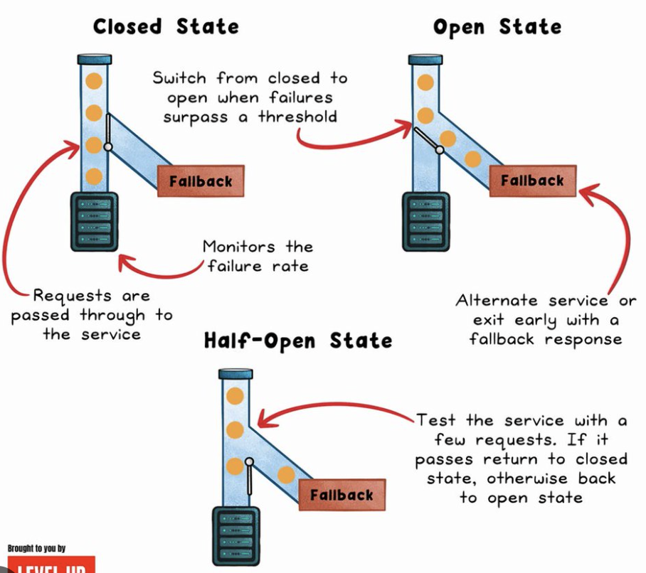
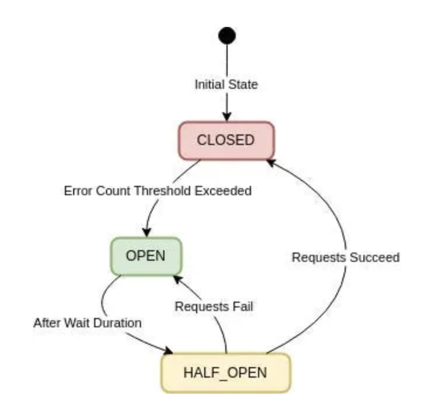

A circuit breaker prevents a failing downstream dependency from cascading into a failure of the caller. Without one, a service that keeps calling a struggling downstream dependency (slow, timing out, or erroring) piles up threads/connections waiting on responses that never come in time — the caller degrades right along with the thing it depends on, even though the caller itself is otherwise perfectly healthy. The pattern is named after an electrical circuit breaker for the same reason: once trouble is detected, it trips and stops the flow deliberately, rather than letting the fault propagate and burn out everything downstream of it.

## 1. The Problem Without One

```
OrderService → calls InventoryService (now slow, taking 30s to respond instead of 50ms)
```

Every request to `OrderService` that needs inventory data now blocks for up to 30 seconds waiting on a response. Under real traffic, threads pile up waiting on the slow dependency, the thread pool exhausts, and `OrderService` itself becomes unresponsive — not because anything is wrong with `OrderService`, but because it kept faithfully calling something that wasn't going to answer in time. A circuit breaker's whole purpose is to stop that pile-up by failing fast instead of waiting.

## 2. The Three States

|                 Image 1                 |                 Image 2                  |
| :-------------------------------------: | :--------------------------------------: |
|  |  |

```
Closed --(failure rate exceeds threshold)--> Open --(wait duration elapses)--> Half-Open --(calls succeed)--> Closed
                                                ^                                     |
                                                └─────────(calls still fail)──────────┘
```

| State     | Behavior                                                                                         |
| --------- | ------------------------------------------------------------------------------------------------ |
| Closed    | Normal operation — calls pass through to the real dependency, failures are counted               |
| Open      | Failing fast — no calls are attempted at all; an immediate error/fallback is returned instead    |
| Half-Open | A limited number of test calls are allowed through to check whether the dependency has recovered |

The key behavioral shift happens at Open: instead of every caller individually discovering the dependency is broken by waiting out a timeout, the breaker short-circuits immediately — hence the name. This turns a slow failure (waiting the full timeout, every time) into a fast one (instant rejection), which is exactly what protects the caller's own resources.

## 3. Implementation with Resilience4j

```java
@Service
public class InventoryClientService {

    @CircuitBreaker(name = "inventoryService", fallbackMethod = "fallbackStock")
    public StockLevel getStock(String sku) {
        return inventoryClient.getStock(sku);
    }

    private StockLevel fallbackStock(String sku, Throwable ex) {
        return StockLevel.unknown(sku); // degrade gracefully instead of propagating the failure
    }
}
```

```yaml
resilience4j.circuitbreaker:
  instances:
    inventoryService:
      failure-rate-threshold: 50 # % of calls failing before the breaker opens
      sliding-window-size: 20 # evaluate the failure rate over the last 20 calls
      wait-duration-in-open-state: 10s # how long to stay Open before trying Half-Open
      permitted-number-of-calls-in-half-open-state: 5
```

The `sliding-window-size` matters: a breaker judging failure rate over too few calls trips on noise (a couple of unlucky slow requests); too large a window and it's slow to react to a genuine, sustained outage. Tune it against the dependency's actual traffic volume and normal failure-rate baseline, not a copy-pasted default.

## 4. Fallbacks: What Happens When the Breaker Is Open

A circuit breaker alone only decides whether to attempt the call — the fallback decides what the caller does instead when it doesn't. Three broad options:

| Fallback strategy                  | Example                                                   | When it's appropriate                                                                   |
| ---------------------------------- | --------------------------------------------------------- | --------------------------------------------------------------------------------------- |
| Return a degraded/default response | `StockLevel.unknown(sku)` instead of the real stock count | The caller can tolerate an approximate or placeholder answer                            |
| Return cached/stale data           | Last-known inventory count from a local cache             | Slight staleness is acceptable for this specific data                                   |
| Fail the request explicitly        | Propagate a clear `503 Service Unavailable` to the client | The data is essential and there's no safe approximation (e.g., a payment authorization) |

Never let the fallback silently pretend success for data where being wrong is worse than failing loudly — a fallback that fabricates a fake "success" for something like a payment confirmation turns a visible outage into a much harder-to-detect correctness bug.

## 5. Circuit Breaker vs. Retry vs. Timeout — Different Jobs

These three are complementary, not interchangeable, and using only one usually isn't enough on its own.

| Mechanism       | Job                                                                  | Without it                                                                                                          |
| --------------- | -------------------------------------------------------------------- | ------------------------------------------------------------------------------------------------------------------- |
| Timeout         | Bounds how long a single call is allowed to take                     | A hung call can block a thread indefinitely                                                                         |
| Retry           | Tries again after a transient failure                                | A single blip fails the request instead of quietly recovering                                                       |
| Circuit breaker | Stops attempting calls at all once a dependency is clearly unhealthy | Every caller individually keeps paying the full timeout cost, request after request, even during a sustained outage |

A common mistake is retrying aggressively into an already-failing dependency — this compounds the load on something already struggling, making recovery slower. The circuit breaker's Open state exists specifically to stop that pattern: once it's clear the dependency isn't answering, stop retrying it altogether until the wait duration elapses.

## 6. Circuit Breaker and Bulkhead Work Together

A circuit breaker decides _whether_ to call a dependency; a bulkhead limits _how much concurrent capacity_ (threads/connections) any one dependency can consume, so a slow dependency can't exhaust resources shared with calls to other, unrelated dependencies. Pairing them means a failing `InventoryService` both gets cut off quickly (circuit breaker) and never had the chance to starve out calls to a healthy `PaymentService` in the meantime (bulkhead) — each protects against a different part of the same underlying risk.

## 7. Best Practices

| Practice                                                                       | Recommendation                                                                                                                     |
| ------------------------------------------------------------------------------ | ---------------------------------------------------------------------------------------------------------------------------------- |
| Always pair a circuit breaker with a sensible timeout                          | The breaker only helps once a call actually fails or times out — an unbounded call can still hang forever without one.             |
| Design a real fallback, not just an empty catch block                          | Decide deliberately what the caller does when the breaker is open — degrade, use cached data, or fail explicitly.                  |
| Never let a fallback silently fabricate a false success                        | Especially for financial/transactional data — a hidden fallback masking a real outage is worse than a visible failure.             |
| Tune the sliding window and failure threshold to the dependency's real traffic | A copy-pasted default can trip on normal noise or fail to react to a genuine sustained outage.                                     |
| Don't retry aggressively into an already-open circuit                          | Let the breaker's Open state do its job — retrying into a known-failing dependency only adds load to something already struggling. |
| Combine with a bulkhead per downstream dependency                              | Prevents one failing dependency's calls from exhausting resources shared with calls to unrelated, healthy dependencies.            |
| Monitor breaker state transitions, not just raw error rates                    | A breaker flipping Open/Half-Open repeatedly is itself a signal worth alerting on, separate from the underlying error rate.        |
