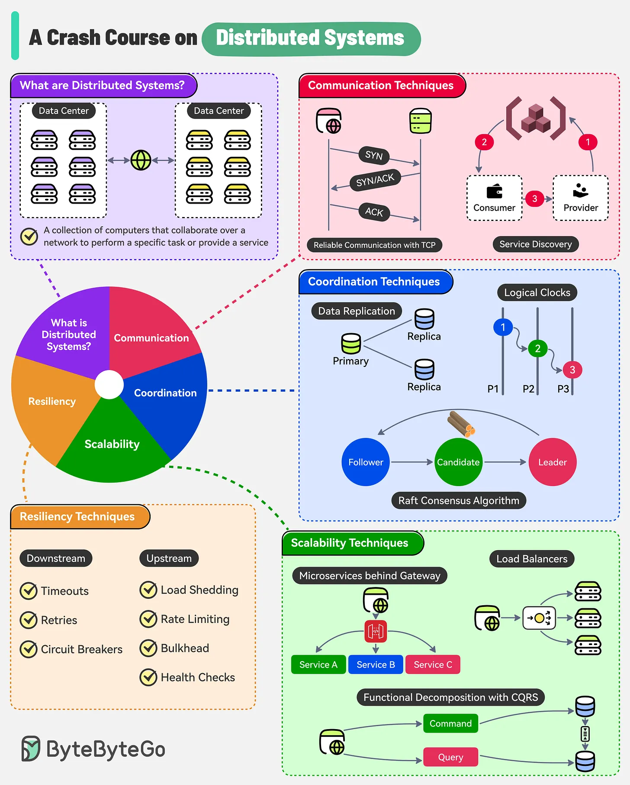

# Distributed Systems — Crash Course

## What is a distributed system?

A collection of computers (nodes, often spread across data centers) that collaborate over a network to act as one service.

## 1. Communication — how nodes talk to each other

- **TCP handshake** (SYN → SYN/ACK → ACK) for reliable delivery between two nodes.
- **Service discovery**: a consumer asks a registry where a provider is, then calls the provider directly.

## 2. Coordination — how nodes agree / stay in sync

- **Data replication**: a primary handles writes, replicas copy the data (for availability and read scaling).
- **Logical clocks**: nodes don't share a real clock, so events are ordered causally (P1 → P2 → P3) instead of by wall-clock time.
- **Raft consensus**: nodes elect a Leader (Follower → Candidate → Leader) so the group agrees on one source of truth even if machines fail.

## 3. Resiliency — how you survive failures

- **Downstream** (calls you make out): timeouts, retries, circuit breakers.
- **Upstream** (calls coming in): load shedding, rate limiting, bulkheads, health checks.
- Theme: fail fast, don't cascade failures, isolate blast radius.

## 4. Scalability — how you handle growth

- **Gateway + microservices** (A/B/C) behind it — split by function, scale independently.
- **Load balancers** — spread requests across replicas.
- **CQRS** — separate the "write" (Command) path from the "read" (Query) path so each scales on its own.

## Interview one-liner

A distributed system trades the simplicity of one machine for scalability and resilience — the cost is you now need explicit strategies for communication, coordination (consensus/ordering), and failure handling that a single process gets for free.
