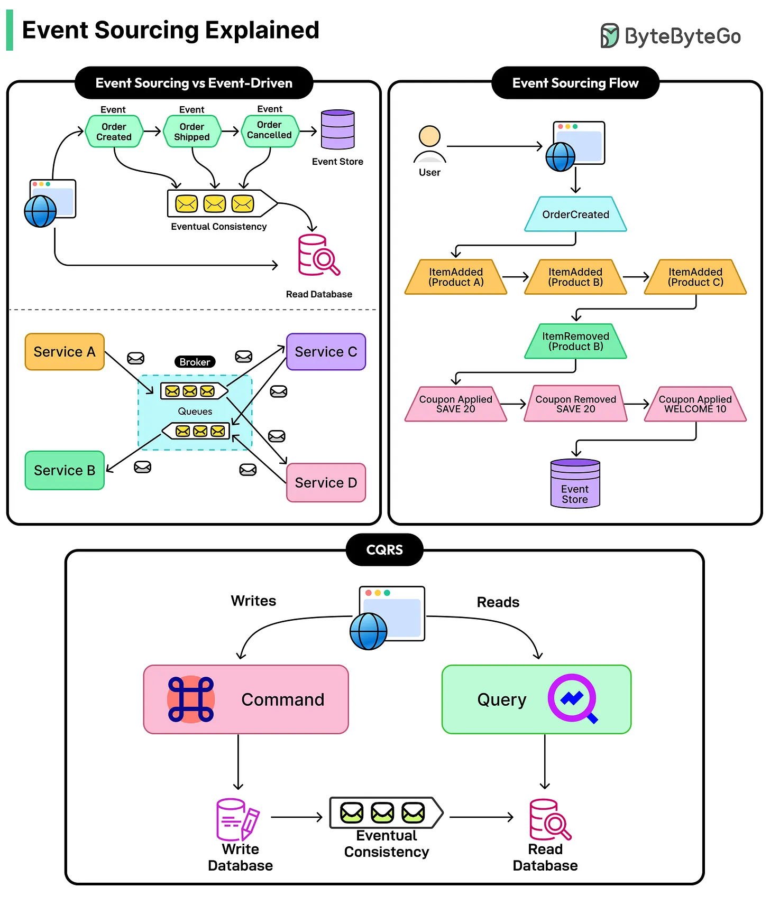
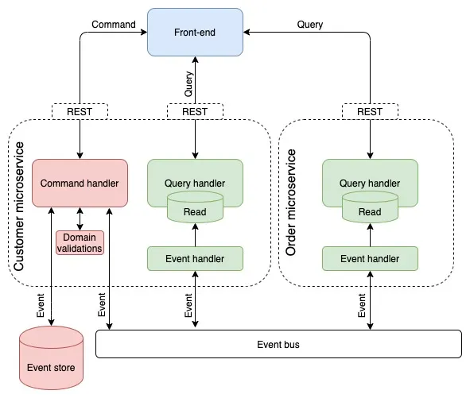

Event sourcing stores every change to an entity as an immutable event, and derives current state by replaying that sequence of events, rather than storing only the current state directly. Instead of a row that gets overwritten on every update, the source of truth becomes an append-only log of everything that ever happened to that entity — current state becomes a derived, rebuildable view, not the thing actually being persisted.





## 1. The Core Idea: Events Are the Source of Truth

```java
public record AccountOpened(String accountId, BigDecimal initialBalance) {}
public record MoneyDeposited(String accountId, BigDecimal amount) {}
public record MoneyWithdrawn(String accountId, BigDecimal amount) {}
```

```sql
CREATE TABLE events (
    id UUID PRIMARY KEY,
    aggregate_id VARCHAR(255) NOT NULL,   -- which entity this event belongs to
    event_type VARCHAR(255) NOT NULL,
    payload JSONB NOT NULL,
    sequence_number INT NOT NULL,          -- this event's position in the aggregate's history
    created_at TIMESTAMP NOT NULL DEFAULT now()
);
```

Nothing is ever updated or deleted from this table — a correction to a mistaken deposit isn't an `UPDATE` to the original row, it's a new event (`MoneyWithdrawn` reversing it) appended afterward. The full history of what happened, and in what order, is preserved permanently and exactly as it occurred.

## 2. Deriving Current State: Replaying Events

Current state is computed by folding over the event stream from the beginning — there's no row anywhere that just holds "the current balance" as stored data; it's recalculated from history.

```java
BigDecimal balance = events.stream()
    .reduce(BigDecimal.ZERO, (bal, event) -> switch (event) {
        case AccountOpened e -> e.initialBalance();
        case MoneyDeposited e -> bal.add(e.amount());
        case MoneyWithdrawn e -> bal.subtract(e.amount());
        default -> bal;
    }, BigDecimal::add);
```

```java
public class Account {
    private BigDecimal balance;

    public static Account replay(List<Event> events) {
        Account account = new Account();
        events.forEach(account::apply);
        return account;
    }

    private void apply(Event event) {
        switch (event) {
            case AccountOpened e -> this.balance = e.initialBalance();
            case MoneyDeposited e -> this.balance = this.balance.add(e.amount());
            case MoneyWithdrawn e -> this.balance = this.balance.subtract(e.amount());
        }
    }
}
```

A write to the aggregate follows the same shape in reverse: load all existing events, replay them to get current state, validate the new command against that state, then append a new event (never modify an existing one) representing what just happened.

## 3. Why Do This: The Benefits

| Benefit                           | Why it matters                                                                                                                                                            |
| --------------------------------- | ------------------------------------------------------------------------------------------------------------------------------------------------------------------------- |
| Complete, permanent audit trail   | Every change is preserved exactly as it happened, with no separate audit-logging mechanism needed — the event log _is_ the audit log                                      |
| Temporal queries                  | "What was this account's balance last Tuesday at 3pm?" is answerable by replaying events up to that point — a snapshot-based model has already discarded that information |
| Natural fit with CQRS             | The event stream is exactly what a read-side projector needs to build denormalized views — event sourcing and CQRS combine cleanly                                        |
| Debugging production issues       | Reproducing "how did the system get into this exact state" means replaying the exact sequence of real events, not guessing from a single current snapshot                 |
| No lost information on correction | A mistaken action is corrected by a new, compensating event — the fact that the mistake happened is never erased from history                                             |

The audit-trail property specifically is why event sourcing shows up disproportionately often in domains with real compliance or dispute-resolution requirements — financial ledgers, order histories, anything where "prove exactly what happened and when" is a real, recurring need rather than a nice-to-have.

## 4. The Cost: Real Complexity

| Cost                                             | Why it hurts                                                                                                                                       |
| ------------------------------------------------ | -------------------------------------------------------------------------------------------------------------------------------------------------- |
| Replaying the full history gets slow as it grows | An account with millions of events takes real time to fold through on every load — this is what snapshots exist to fix (see below)                 |
| Querying current state directly is awkward       | "Find all accounts with a balance over $10,000" has no simple table to query — this is exactly the gap CQRS read-side projections fill             |
| Event schema evolution is a long-term commitment | An event written five years ago must still be deserializable and meaningful today — you can't just alter a column like you could in a normal table |
| Team unfamiliarity                               | Modeling everything as immutable historical facts, rather than mutable current state, is a genuine mental shift from typical CRUD thinking         |

This is real, ongoing complexity — not a one-time setup cost — which is why event sourcing is a deliberate architectural commitment for a specific aggregate/bounded context, not a default choice to apply everywhere.

## 5. Snapshots: Making Replay Fast Again

Once an aggregate has accumulated thousands of events, replaying all of them on every load becomes a real performance problem. A snapshot periodically stores the fully-computed current state, so a load only needs to replay events _since_ the last snapshot, not from the very beginning.

```java
public class Account {
    public static Account loadFrom(Snapshot snapshot, List<Event> eventsSinceSnapshot) {
        Account account = snapshot != null ? snapshot.toAccount() : new Account();
        eventsSinceSnapshot.forEach(account::apply);
        return account;
    }
}
```

```sql
CREATE TABLE snapshots (
    aggregate_id VARCHAR(255) PRIMARY KEY,
    state JSONB NOT NULL,
    sequence_number INT NOT NULL, -- events up to and including this point are already folded into `state`
    created_at TIMESTAMP NOT NULL
);
```

A snapshot is purely a performance optimization — it's disposable and rebuildable from the event log at any time, never the source of truth itself. Taking one every N events (e.g., every 100) is a common approach: frequent enough that replay stays fast, infrequent enough that snapshotting itself isn't a significant overhead.

## 6. Event Sourcing and CQRS: Related, Not the Same

Event sourcing is about _how the write side stores state_ (as events, not current-state rows); CQRS is about _splitting the write model from the read model_. They combine naturally — the event stream event sourcing already produces is exactly the input a CQRS read-side projector needs — but each can exist without the other: a CQRS write side can be an ordinary normalized table that just happens to publish change events, and an event-sourced aggregate could in principle be queried directly (awkwardly) without a separate CQRS read model at all. In practice, they're adopted together often enough that people sometimes conflate them, but they're solving two different problems.

## 7. Event Schema Evolution

Because old events must remain readable indefinitely (they're the permanent source of truth, not a disposable cache), evolving the event schema needs the same discipline as evolving any long-lived public contract.

```java
// Adding a new field to a future version of an existing event type
public record MoneyDeposited(String accountId, BigDecimal amount, String source) {
    // `source` didn't exist in older events — deserialization must supply a sensible default for them
    public static MoneyDeposited fromLegacyPayload(JsonNode json) {
        return new MoneyDeposited(
            json.get("accountId").asText(),
            new BigDecimal(json.get("amount").asText()),
            json.has("source") ? json.get("source").asText() : "UNKNOWN" // default for pre-existing events
        );
    }
}
```

Common approaches: additive-only changes (new optional fields with defaults for old events), versioned event types (`MoneyDepositedV2`) with explicit upcasting logic converting old versions to new when replayed, or a dedicated migration process that rewrites the event store itself (rare, and risky, since it touches the permanent historical record).

## 8. When Event Sourcing Is Worth It

| Situation                                                                                                                  | Event sourcing justified?                                                                                  |
| -------------------------------------------------------------------------------------------------------------------------- | ---------------------------------------------------------------------------------------------------------- |
| A genuine, recurring need to know exactly what happened and when, for compliance/dispute resolution                        | Yes — this is the scenario the pattern exists for                                                          |
| The domain naturally thinks in terms of things that happened (orders placed, payments made) rather than just current state | Yes — the model fits the domain's actual language                                                          |
| A simple CRUD entity with no audit/history requirement                                                                     | No — pure overhead: replay cost, snapshotting, and schema evolution discipline with nothing to show for it |
| The team has no prior experience with the pattern and the deadline is tight                                                | Reconsider — it's a genuine paradigm shift, not a drop-in library choice                                   |

## 9. Best Practices

| Practice                                                                | Recommendation                                                                                                                              |
| ----------------------------------------------------------------------- | ------------------------------------------------------------------------------------------------------------------------------------------- |
| Reserve event sourcing for aggregates with a genuine audit/history need | Applying it to simple CRUD entities adds real, ongoing complexity for no corresponding benefit.                                             |
| Use snapshots once replay time becomes a real cost                      | Snapshots are disposable and always rebuildable — never treat one as the source of truth itself.                                            |
| Pair with CQRS for querying current state efficiently                   | Direct queries against a raw event stream are awkward — a projected read model solves this cleanly.                                         |
| Design events as immutable historical facts, never corrected in place   | A mistake is undone by a new compensating event, not by editing or deleting the original record.                                            |
| Plan for event schema evolution from day one                            | Old events must remain deserializable indefinitely — additive changes and explicit upcasting are safer than altering existing event shapes. |
| Keep events as the single source of truth                               | Snapshots and read-side projections must always be rebuildable from the event log — never let one become authoritative on its own.          |
| Don't event-source everything by default                                | It's a deliberate architectural commitment for specific aggregates that need it, not a system-wide persistence strategy.                    |
