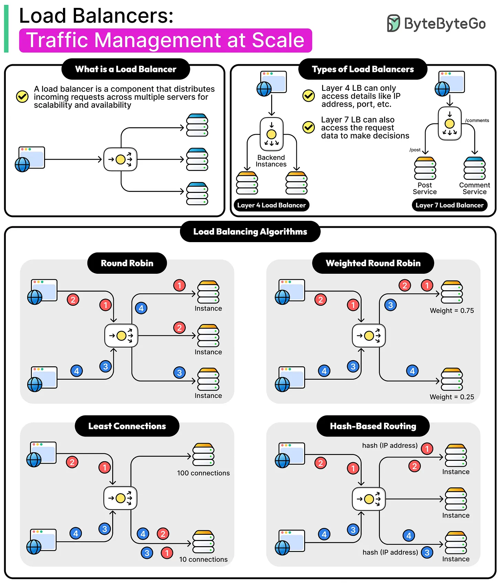
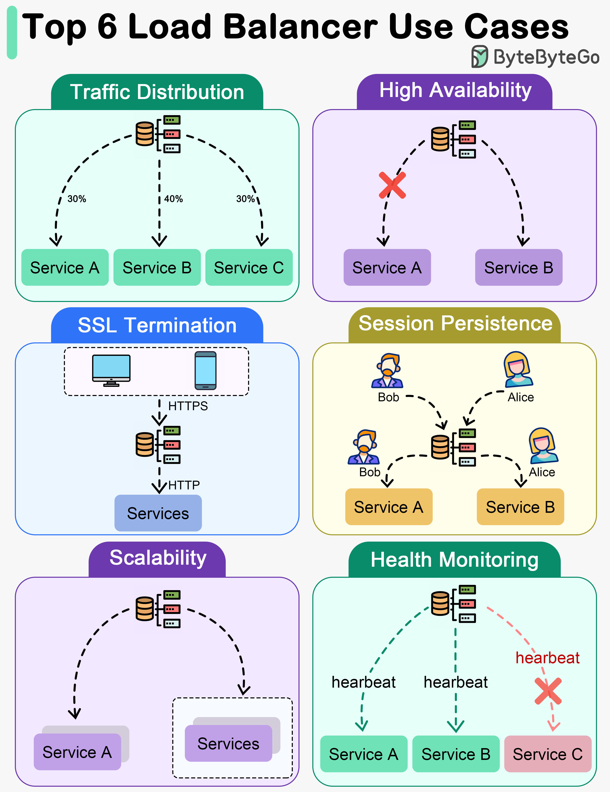

Load balancing distributes incoming requests across multiple instances of a service so no single instance is overwhelmed while others sit idle, and so the system keeps working when one instance fails. In a microservices architecture every service typically runs as multiple replicas, which means load balancing isn't optional — it's the mechanism that makes "multiple replicas" actually behave like one reliable, scalable service from the caller's point of view.

## 1. Client-Side vs. Server-Side Load Balancing

| Approach    | How it works                                                                                                                                         | Example                                                                                      |
| ----------- | ---------------------------------------------------------------------------------------------------------------------------------------------------- | -------------------------------------------------------------------------------------------- |
| Server-side | A dedicated component (reverse proxy, hardware/cloud LB) sits in front of the instances; every caller talks to it, it forwards to a backend instance | An AWS ALB, NGINX, or an API Gateway in front of a service                                   |
| Client-side | The caller itself knows the full list of available instances and picks one directly, no intermediary hop                                             | Spring Cloud LoadBalancer picking an instance from a service registry before making the call |

Server-side load balancing adds one predictable network hop and centralizes the routing decision, which is simpler to reason about and secure. Client-side load balancing removes that hop (lower latency, one less thing to scale), but pushes the routing logic — and the responsibility of keeping the instance list fresh — into every single caller.

```java
// Client-side: Spring Cloud LoadBalancer resolves "order-service" to a specific instance per call
@LoadBalanced
@Bean
public RestClient.Builder restClientBuilder() {
    return RestClient.builder();
}

// Calling code just uses the logical service name — the instance is chosen underneath
restClient.get().uri("http://order-service/api/orders/{id}", orderId).retrieve();
```

## 2. Load Balancing Algorithms




| Algorithm            | Behavior                                                                                                                     | Best for                                                                                                   |
| -------------------- | ---------------------------------------------------------------------------------------------------------------------------- | ---------------------------------------------------------------------------------------------------------- |
| Round robin          | Requests rotate through instances in a fixed cyclic order                                                                    | Instances with roughly equal capacity and roughly equal-cost requests                                      |
| Weighted round robin | Round robin, but some instances get proportionally more requests                                                             | Heterogeneous instance sizes (a bigger box gets a higher weight)                                           |
| Least connections    | Send the next request to whichever instance currently has the fewest active connections                                      | Requests with widely varying processing time, where round robin could pile slow requests onto one instance |
| Random               | Pick an instance at random                                                                                                   | Very cheap to implement, statistically similar to round robin at scale                                     |
| Consistent hashing   | Route based on a hash of some request attribute (e.g., customer ID), so the same key consistently lands on the same instance | Sticky sessions, or maximizing cache hit rate when an instance caches per-key data                         |

Least connections is generally a better default than round robin for real-world services, because round robin assumes every request costs the same to process — which is rarely true once request complexity varies (a report generation call next to a simple lookup call).

## 3. Health Checks: Don't Route to a Broken Instance

A load balancer is only as good as its view of which instances are actually healthy. Every instance needs to expose a way for the load balancer to know it's not just running, but actually able to serve traffic correctly.

```java
@Component
public class DownstreamHealthIndicator implements HealthIndicator {
    @Override
    public Health health() {
        return isDownstreamReachable()
            ? Health.up().build()
            : Health.down().withDetail("reason", "downstream unreachable").build();
    }
}
```

| Check type | Question it answers                               | Consequence of failing                                                |
| ---------- | ------------------------------------------------- | --------------------------------------------------------------------- |
| Liveness   | Is the process still running and not deadlocked?  | Kubernetes restarts the container                                     |
| Readiness  | Is the instance currently able to handle traffic? | Load balancer stops routing new requests to it, without restarting it |

The distinction matters: a temporarily overloaded instance should fail readiness (stop receiving new traffic until it recovers) without being killed and restarted, which would just make the overall capacity problem worse at the exact moment it's least helpful.

## 4. Load Balancing at Every Layer

Load balancing isn't one component — it shows up at several layers simultaneously in a typical microservices deployment, each solving the same underlying problem at a different scope.

```
DNS / Global LB   → routes traffic across regions
  → Cloud LB (ALB/NLB) → routes traffic across availability zones to the cluster
    → Kubernetes Service → routes traffic across pod replicas within the cluster
      → Client-side LB (in-process) → picks a specific downstream service instance for an outbound call
```

Each layer is unaware of the others' internal decisions — the Kubernetes Service doesn't know or care how the cloud LB chose to route traffic to this node, and that's intentional: each layer solves distribution at its own scope, and the layers compose without needing to coordinate directly.

## 5. Session Affinity (Sticky Sessions) — A Tradeoff, Not a Default

Some load balancers can pin a client to the same backend instance for the duration of a session (via a cookie or consistent hashing), useful when an instance holds in-memory state (a session, a WebSocket connection) that isn't shared across instances.

```yaml
# NGINX sticky sessions via cookie
upstream backend {
    ip_hash; # routes based on client IP — a simple form of session affinity
    server order-service-1:8080;
    server order-service-2:8080;
}
```

The cost: sticky sessions undermine even distribution (some instances end up busier than others depending on which clients happen to be active) and complicate scaling down (killing an instance drops every session pinned to it). Prefer externalizing session state (Redis-backed sessions) so any instance can serve any request, and reserve sticky sessions for cases that genuinely require it, like a long-lived WebSocket connection that can't be transparently moved mid-connection.

## 6. Load Balancing and Circuit Breakers Work Together

A load balancer alone doesn't protect the system from a partially failing instance that responds slowly instead of cleanly failing health checks — it can keep sending traffic to a struggling instance right up until it fails a check. Pairing load balancing with a circuit breaker and retry-with-backoff on the caller side (Resilience4j) closes that gap: if calls to a specific instance start failing or timing out, the circuit breaker stops sending it traffic faster than a health check interval alone would catch, and a retry can transparently land on a different, healthy instance instead of surfacing the failure to the end user.

## 7. Best Practices

| Practice                                                               | Recommendation                                                                                                                                                           |
| ---------------------------------------------------------------------- | ------------------------------------------------------------------------------------------------------------------------------------------------------------------------ |
| Use readiness checks, not just liveness checks, to gate traffic        | An instance can be "alive" but temporarily unable to serve traffic — only readiness should control routing.                                                              |
| Default to least-connections over round robin for uneven request costs | Round robin assumes every request is equally expensive, which is rarely true in practice.                                                                                |
| Externalize session state instead of relying on sticky sessions        | Lets any instance serve any request, and makes scaling down safe without dropping active sessions.                                                                       |
| Pair load balancing with circuit breakers and retries                  | A load balancer alone can't detect a slow-but-technically-healthy instance as fast as a circuit breaker can.                                                             |
| Weight instances if they differ in capacity                            | Equal-share round robin on unequal hardware just overloads the smaller instances.                                                                                        |
| Treat each layer of load balancing independently                       | DNS/global, cloud LB, Kubernetes Service, and client-side LB each solve distribution at a different scope — don't assume one layer's health view is shared with another. |
| Reserve session affinity for genuine stateful connections              | Use it for things like WebSockets that can't be transparently relocated, not as a default convenience.                                                                   |
