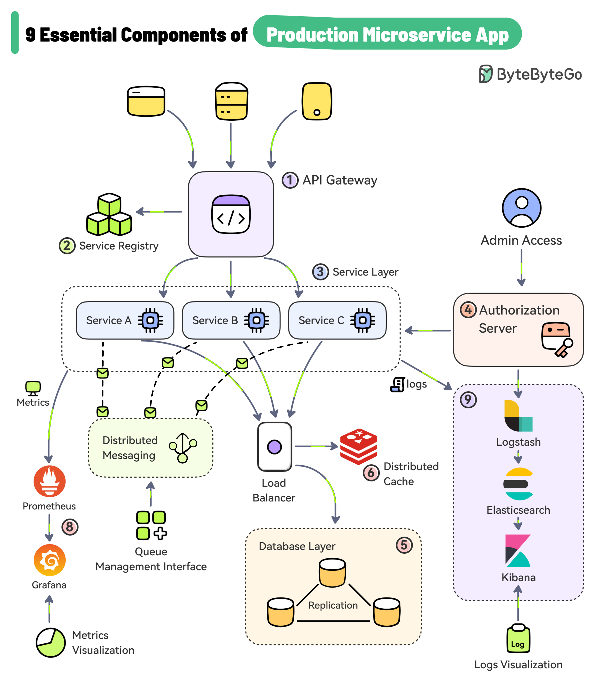

Microservices patterns solve problems that only exist once you split a monolith into independently deployed services: network unreliability, distributed data consistency, cross-cutting concerns duplicated across services, and observability across process boundaries. Most of these are Java-ecosystem-agnostic, but examples below use Spring Cloud / Resilience4j where relevant since that's the common Java toolchain.



## 1. Decomposition: How to Split in the First Place

| Strategy                         | Splits by              | Example                                                                   |
| -------------------------------- | ---------------------- | ------------------------------------------------------------------------- |
| Decompose by business capability | What the business does | `OrderService`, `InventoryService`, `BillingService`                      |
| Decompose by subdomain (DDD)     | Bounded contexts       | `Catalog` context vs `Fulfillment` context, even if both touch "products" |

Rule of thumb: a service should own its data exclusively — if two services need direct SQL access to the same tables, they're not actually decoupled, just a distributed monolith.

## 2. Database per Service

Each service owns its own database/schema; no service reaches into another's tables directly. Cross-service data access happens only through APIs or events — never shared SQL.

```
OrderService  → orders_db      (owns Order, OrderLine)
InventoryService → inventory_db (owns Stock, Reservation)
```

Consequence: joins across services are impossible at the DB level — you either denormalize (keep a local read copy), call the other service's API, or use events to keep a local cache in sync (see CQRS below).

## 3. API Gateway

A single entry point that routes requests to the right backend service, and centralizes cross-cutting concerns (auth, rate limiting, request logging) instead of duplicating them in every service.

```yaml
# Spring Cloud Gateway route config
spring:
  cloud:
    gateway:
      routes:
        - id: order-service
          uri: lb://order-service
          predicates:
            - Path=/api/orders/**
        - id: inventory-service
          uri: lb://inventory-service
          predicates:
            - Path=/api/inventory/**
```

Avoid turning the gateway into a second monolith — it should route and enforce cross-cutting policy, not contain business logic.

## 4. Service Discovery

Services register themselves at startup and look each other up by name instead of hardcoded host:port — necessary because service instances scale up/down and move between hosts/containers.

```java
@FeignClient(name = "inventory-service") // resolves via the discovery registry (e.g. Eureka, Consul)
public interface InventoryClient {
    @GetMapping("/api/inventory/{sku}")
    StockLevel getStock(@PathVariable String sku);
}
```

## 5. Circuit Breaker

Prevents a failing downstream service from cascading failures upstream — after enough failures, the breaker "opens" and fails fast instead of piling up threads waiting on a dead service.

```java
@Service
public class InventoryClientService {

    @CircuitBreaker(name = "inventoryService", fallbackMethod = "fallbackStock")
    public StockLevel getStock(String sku) {
        return inventoryClient.getStock(sku);
    }

    private StockLevel fallbackStock(String sku, Throwable ex) {
        return StockLevel.unknown(sku); // degrade gracefully instead of propagating the failure
    }
}
```

```yaml
resilience4j.circuitbreaker:
  instances:
    inventoryService:
      failure-rate-threshold: 50
      wait-duration-in-open-state: 10s
      sliding-window-size: 20
```

Circuit Breaker states: **Closed** (normal, calls pass through) → **Open** (failing fast, no calls attempted) → **Half-Open** (a few test calls allowed through to check recovery) → back to Closed or Open.

## 6. Bulkhead

Isolates resources (thread pools, connection pools) per downstream dependency so that one slow/failing service can't exhaust resources needed by calls to other services — named after ship compartments that contain flooding.

```yaml
resilience4j.bulkhead:
  instances:
    inventoryService:
      max-concurrent-calls: 10
    paymentService:
      max-concurrent-calls: 20
```

Without a bulkhead, a slow `InventoryService` can consume every thread in a shared pool, starving unrelated calls to `PaymentService` even though it's healthy.

## 7. Saga Pattern — Distributed Transactions

Since each service has its own database, you can't use a single ACID transaction across services. A Saga is a sequence of local transactions, each publishing an event that triggers the next step; failures trigger compensating transactions to undo prior steps.

```java
// Choreography-style: services react to each other's events, no central coordinator
@EventListener
public void onOrderCreated(OrderCreatedEvent event) {
    try {
        inventoryService.reserveStock(event.getOrderId(), event.getItems());
        publisher.publishEvent(new StockReservedEvent(event.getOrderId()));
    } catch (InsufficientStockException ex) {
        publisher.publishEvent(new OrderFailedEvent(event.getOrderId(), "OUT_OF_STOCK"));
        // OrderService listens for OrderFailedEvent and compensates (cancels the order)
    }
}
```

Two coordination styles:

- **Choreography**: services react to each other's events directly — simple for a few steps, hard to trace as the chain grows.
- **Orchestration**: a central saga orchestrator tells each service what to do next and handles compensation explicitly — easier to reason about and debug for complex, multi-step sagas.

## 8. CQRS (Command Query Responsibility Segregation)

Separates the write model (commands, business rules, normalized schema) from the read model (queries, denormalized for fast reads) — often paired with events to keep the read model in sync.

```java
// Write side — enforces business rules, normalized schema
@PostMapping("/orders")
public void createOrder(@RequestBody CreateOrderCommand cmd) {
    orderService.create(cmd); // validates, persists to the write DB, publishes OrderCreatedEvent
}

// Read side — denormalized, optimized for the exact query the UI needs
@GetMapping("/orders/{id}/summary")
public OrderSummaryView getSummary(@PathVariable String id) {
    return orderSummaryReadRepository.findById(id); // pre-joined, updated asynchronously via events
}
```

Only reach for CQRS when read and write patterns genuinely diverge (e.g., complex reporting views vs. simple transactional writes) — for a simple CRUD service it's pure overhead.

## 9. Event Sourcing

Instead of storing current state, store the sequence of events that led to it; current state is derived by replaying events. Often paired with CQRS (events feed the read-model projections).

```java
public record AccountOpened(String accountId, BigDecimal initialBalance) {}
public record MoneyDeposited(String accountId, BigDecimal amount) {}
public record MoneyWithdrawn(String accountId, BigDecimal amount) {}

// Current balance = fold over the event stream
BigDecimal balance = events.stream()
    .reduce(BigDecimal.ZERO, (bal, event) -> switch (event) {
        case AccountOpened e -> e.initialBalance();
        case MoneyDeposited e -> bal.add(e.amount());
        case MoneyWithdrawn e -> bal.subtract(e.amount());
        default -> bal;
    }, BigDecimal::add);
```

Gives you a full audit log for free, but adds real complexity (event versioning/migration, snapshotting for performance). Don't adopt it unless the audit trail or temporal queries ("what was the balance last Tuesday?") are actual requirements.

## 10. Strangler Fig — Migrating a Monolith Incrementally

Gradually replace parts of a legacy monolith by routing specific requests to new services while the rest still goes to the monolith, until nothing is left to strangle.

```
Gateway routes:
  /api/orders/**    → new OrderService (migrated)
  /api/**           → legacy monolith (not yet migrated)
```

Safer than a big-bang rewrite: each slice ships independently, and the monolith keeps working throughout the migration.

## 11. Sidecar Pattern

Deploys auxiliary functionality (logging, service mesh proxy, metrics) as a separate process alongside the service instance, rather than embedding it as a library in every service — common in Kubernetes with Istio/Envoy sidecars.

Benefit: cross-cutting infrastructure concerns (mTLS, retries, tracing) get upgraded independently of application code, and stay consistent across services written in different languages.

## 12. Control Plane vs Data Plane

A recurring split in distributed systems: the **data plane** is what actually processes each transaction/request as it flows through the system, on the hot path, under strict latency requirements; the **control plane** is what defines the rules the data plane enforces — configuration, product definitions, policy — updated far less often and able to tolerate being briefly slow or unavailable without stopping live traffic. Splitting the two means the part that must never go down (processing a payment) doesn't share a failure mode or a latency budget with the part that's inherently slower and more human-facing (an ops team changing a product rule).

|                | Data plane                                                       | Control plane                                                                                           |
| -------------- | ---------------------------------------------------------------- | ------------------------------------------------------------------------------------------------------- |
| Job            | Executes the decision, on the critical path of every transaction | Defines the decision's rules, off the critical path                                                     |
| Latency budget | Milliseconds — directly adds to transaction processing time      | Seconds to minutes — a rule change propagating a bit late rarely matters                                |
| Failure impact | Down = transactions fail immediately                             | Down = the system keeps processing on its last-known-good rules; only _new_ rule changes can't roll out |
| Who touches it | Called by every transaction, automatically                       | Changed rarely, usually by an ops/product team through an admin UI or API                               |

### Example: Core Banking Transaction Processing

In a core banking platform, the transaction/ledger posting engine is the data plane — it must evaluate account limits, interest terms, and fee rules for every single transfer/payment, in real time, with strict latency and correctness guarantees (it's directly on the money-movement path). The product configuration service — where an ops or product team defines daily withdrawal limits, interest rates, and fee schedules per account product — is the control plane: it's touched rarely, by humans, and can be slow or briefly unavailable without stopping a single transaction from processing, as long as the transaction engine already has the current rules cached locally.

```java
// Control plane: product/limit rules are defined here, off the transaction hot path.
// This service can be slow, can go through an approval workflow, can even be briefly
// down — none of that blocks a single customer transaction from processing.
@RestController
public class ProductRuleAdminController {

    @PutMapping("/products/{productCode}/rules")
    public void updateRules(@PathVariable String productCode, @RequestBody ProductRules rules) {
        productRuleRepository.save(productCode, rules);
        ruleUpdatePublisher.publish(new ProductRulesUpdatedEvent(productCode, rules));
    }
}

public record ProductRules(BigDecimal dailyWithdrawalLimit, BigDecimal interestRate, BigDecimal overdraftFee) {}
```

```java
// Data plane: the transaction engine holds its own local, continuously-refreshed copy
// of every product's rules, and evaluates them in-process — no network call to the
// control plane per transaction, because a payment can't wait on an admin service's latency.
@Component
public class TransactionRuleCache {
    private final Map<String, ProductRules> rulesByProduct = new ConcurrentHashMap<>(); // see async-programming

    @EventListener
    public void onRulesUpdated(ProductRulesUpdatedEvent event) {
        rulesByProduct.put(event.productCode(), event.rules()); // async refresh, off the transaction hot path
    }

    public ProductRules rulesFor(String productCode) {
        return rulesByProduct.get(productCode); // O(1) local lookup, no control-plane round trip
    }
}

@Service
public class TransferService {
    private final TransactionRuleCache ruleCache;

    @Transactional
    public void transfer(Account from, BigDecimal amount) {
        ProductRules rules = ruleCache.rulesFor(from.getProductCode());
        if (from.getTodaysWithdrawals().add(amount).compareTo(rules.dailyWithdrawalLimit()) > 0) {
            throw new DailyLimitExceededException(from.getId(), amount, rules.dailyWithdrawalLimit());
        }
        // ... proceed with the transfer, still fully processed even if ProductRuleAdminController is down right now
    }
}
```

The critical property: `TransferService.transfer()` never calls the control plane synchronously. If the product rule admin service is completely down, every transfer still gets evaluated correctly against the last-known rules — a core banking system can't tolerate "payment processing paused because the admin config service had a blip." The same split shows up elsewhere in banking platforms: real-time fraud/risk scoring (data plane, must approve/decline within milliseconds) versus fraud rule/model management (control plane, where risk analysts tune thresholds); or interest accrual posting (data plane, runs nightly/real-time against every account) versus interest rate configuration (control plane, changed occasionally per product).

### Why Not Just Call the Control Plane Directly?

It's tempting to skip the local cache and have the transaction engine call the product rule service synchronously for every transaction — simpler, always up to date. The reason this is usually wrong in a core banking context: it makes transaction processing's availability and latency a function of a second service's availability and latency, for data (product rules) that changes on the order of days, not per-transaction. This is the same reasoning behind preferring async events for cross-service side effects and the Bulkhead/Circuit Breaker patterns earlier in this file — don't let a slow-changing, rarely-called dependency sit synchronously in the path of your highest-volume, most latency-sensitive operation.

## 13. Observability Across Services

Once a request spans multiple services, you need distributed tracing to follow it — logs and metrics from a single service alone won't show you the full picture.

```java
// Spring Cloud Sleuth / Micrometer Tracing propagates a trace ID across service calls automatically
// Each service's logs include the same traceId, so you can correlate a request across all of them
log.info("Processing order {}", orderId); // traceId automatically included via MDC
```

Tools: OpenTelemetry (vendor-neutral standard), Zipkin/Jaeger (trace visualization).

## 14. Best Practices

| Practice                                           | Recommendation                                                                                                                 |
| -------------------------------------------------- | ------------------------------------------------------------------------------------------------------------------------------ |
| One database per service                           | Never let two services share direct SQL access to the same tables.                                                             |
| Design for failure                                 | Assume any network call can fail, time out, or hang — always pair remote calls with timeouts, circuit breakers, and fallbacks. |
| Prefer async events for cross-service side effects | Reduces temporal coupling — the caller doesn't block on every downstream service being up.                                     |
| Choose Saga orchestration for complex flows        | Choreography is fine for 2-3 steps; beyond that, an explicit orchestrator is easier to debug and evolve.                       |
| Only adopt CQRS/Event Sourcing when justified      | Both add real complexity — use them for genuine read/write divergence or audit requirements, not by default.                   |
| Instrument for distributed tracing from day one    | Retrofitting trace propagation across many services later is far more painful than baking it in early.                         |
| Version your APIs and events                       | Services deploy independently — a breaking change to a shared contract can't roll out atomically across all consumers.         |
