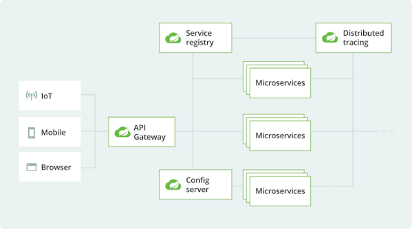

# Spring Cloud Concepts: Simplifying Microservices Architecture

Spring Cloud is a set of tools built on top of Spring Boot to solve the common operational and architectural challenges of running microservices in a cloud environment.



When transitioning from a monolithic application to microservices, systems face issues like hardcoded network addresses, dynamic scaling, configuration management, cascading network failures, and fragmented logs. Below is an overview of how Spring Cloud addresses these challenges.

---

## 1. Service Discovery & Load Balancing

### The Problem

In a dynamic cloud environment, microservice instances start, stop, and scale automatically. IP addresses and ports change frequently. Hardcoding network locations (e.g., `http://192.168.1.15:8081`) breaks services as soon as an instance restarts or moves.

### Spring Cloud Solution

- **Netflix Eureka (Service Registry):** Acts as a dynamic registry. Every service registers its name and current IP/port with Eureka upon startup.
- **Client-Side Load Balancing (`@LoadBalanced`):** Integrates with HTTP clients (such as `RestTemplate` or `WebClient`) to resolve abstract service names using Eureka, routing traffic across healthy instances automatically.

```java
// Spring automatically resolves 'product-service' into an available host:port
String productInfo = restTemplate.getForObject("http://product-service/products/101", String.class);
```

---

## 2. Centralized Configuration Management

### The Problem

In a system with dozens of microservices, modifying configuration parameters (e.g., API keys, database URLs, feature flags) requires updating individual `application.properties` files across repos and manually redeploying each service.

### Spring Cloud Solution

- **Spring Cloud Config Server:** Centralizes application configurations in an external repository (typically Git).
- Microservices pull environment-specific settings dynamically at startup or runtime without requiring service rebuilds.

---

## 3. Resilience and Fault Tolerance

### The Problem

Remote network calls between microservices can fail, time out, or experience high latency. If an upstream service stalls, incoming requests block, exhausting system threads and causing a cascading failure across the entire application stack.

### Spring Cloud Solution

- **Resilience4j:** Provides design patterns for fault isolation:
  - **Retry:** Automatically re-attempts failed network calls up to a configured threshold.
  - **Fallback:** Returns default or cached responses when downstream dependencies fail.
  - **Circuit Breaker:** Cuts off requests to an unresponsive service to prevent resource exhaustion and allow it time to recover.

```java
@Retry(name = "productService", fallbackMethod = "fallback")
public String getProduct() {
    return restTemplate.getForObject("http://product-service/products", String.class);
}

// Graceful fallback execution when retries fail
public String fallback(Exception e) {
    return "Fallback: Default product details are temporarily unavailable.";
}
```

---

## 4. Distributed Tracing & Observability

### The Problem

A single client action may trigger a chain of requests: `Gateway` $\rightarrow$ `Order Service` $\rightarrow$ `Product Service` $\rightarrow$ `Payment Service`. When an error occurs or latencies spike, tracking down the exact root cause across isolated service logs is difficult.

### Spring Cloud Solution

- **Micrometer Tracing / Spring Cloud Sleuth:** Attaches a unique **Trace ID** and **Span ID** to HTTP headers and log outputs across the entire request lifecycle.
- **Zipkin:** Collects tracing data and provides a visual dashboard to inspect end-to-end request latency, dependency maps, and exact points of failure.

---

## 5. API Gateway

### The Problem

Exposing individual microservice endpoints directly to public clients introduces security vulnerabilities, CORS complications, and forces clients to track dozens of internal URLs.

### Spring Cloud Solution

- **Spring Cloud Gateway:** Provides a single entry point (reverse proxy) for all incoming client traffic. It manages cross-cutting concerns, including:
  - Route redirection to underlying instances
  - Authentication and authorization checks
  - Global rate limiting and request/response transformations

---

## Component Summary Matrix

| Architectural Challenge | Spring Cloud Component       | Key Function                                       |
| :---------------------- | :--------------------------- | :------------------------------------------------- |
| **Service Resolution**  | Netflix Eureka               | Dynamic service registration and lookups           |
| **Config Drift**        | Spring Cloud Config          | Centralized configuration management via Git       |
| **Network Failures**    | Resilience4j                 | Retries, circuit breakers, and fallback handlers   |
| **Distributed Logging** | Sleuth / Micrometer + Zipkin | Request-flow tracing and visual performance graphs |
| **Unified Entry Point** | Spring Cloud Gateway         | Edge routing, security, and rate-limiting          |
