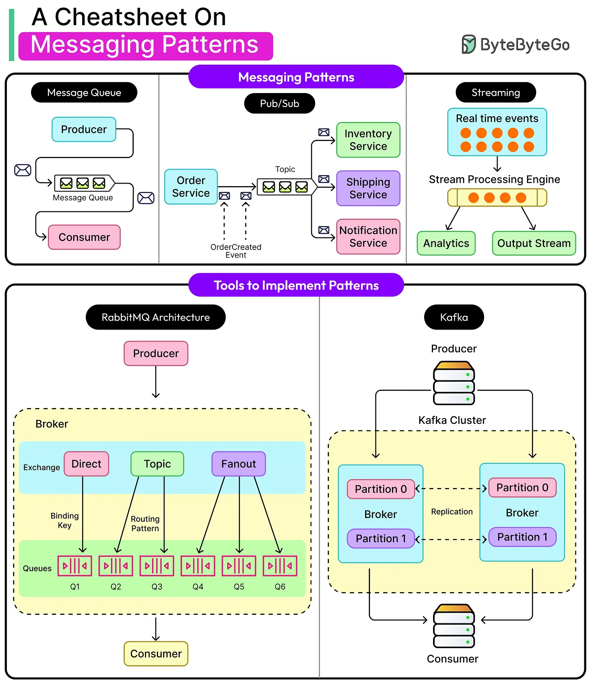

Message Queues: One producer, one consumer. Tasks get processed once and only once.

Publish-Subscribe: One producer, many consumers. Messages fan out to multiple subscribers.

Event Streams: A durable, replayable log of events. Consumers can rewind, catch up, or read in parallel.
