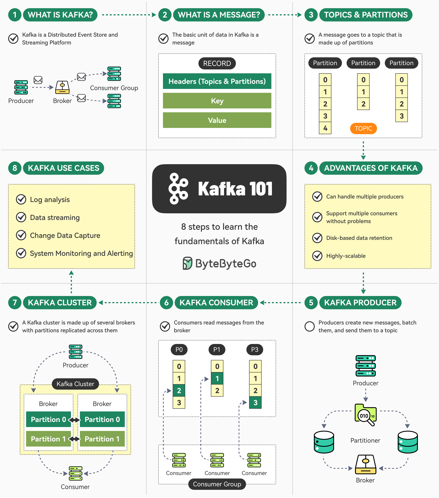

# Apache Kafka: Architectural Overview, Core Concepts, and Practical Application



## 1. Internal Storage Engine Architecture

Apache Kafka acts as a distributed commit log designed for high-throughput append-only writes, sequential disk reads, and horizontal scaling.

```
+-----------------------------------------------------------------------+
|                            PRODUCERS                                  |
+-----------------------------------------------------------------------+
                                  |
                                  v (Push)
+-----------------------------------------------------------------------+
|                           KAFKA BROKERS                               |
|                                                                       |
|  +-----------------------------------------------------------------+  |
|  | Topic: ride-updates                                             |  |
|  |                                                                 |  |
|  |  +-----------------------------------------------------------+  |  |
|  |  | Partition 0 (Leader: Broker 1)                            |  |  |
|  |  | [Segment 000.log] -> [Segment 001.log (Active)]           |  |  |
|  |  +-----------------------------------------------------------+  |  |
|  |  | Partition 1 (Leader: Broker 2)                            |  |  |
|  |  +-----------------------------------------------------------+  |  |
|  +-----------------------------------------------------------------+  |
+-----------------------------------------------------------------------+
                                  |
                                  v (Pull)
+-----------------------------------------------------------------------+
|                            CONSUMERS                                  |
+-----------------------------------------------------------------------+
```

### Key Low-Level Mechanics

- **Append-Only Commit Logs:** Messages in a topic partition are organized sequentially. New events are appended to the active segment file on disk. In-place updates do not occur; data is immutable once written.
- **Segments and Indexes:** Each partition directory contains multiple segment files (e.g., `0000.log`). To instantly map sequential message sequence numbers (**Offsets**) to exact byte positions on disk, Kafka maintains accompanying `.index` (offset-to-position mapping) and `.timeindex` files.
- **Page Cache & Zero-Copy Transports:** Kafka delegates memory management to the OS Page Cache rather than managing heap inside the JVM. When sending data from disk to consumer sockets, it utilizes the kernel `sendfile()` system call (Zero-Copy). This transfers pages directly from the Page Cache to the network buffer, eliminating context switches and RAM copies between user space and kernel space.

---

## 2. Core Concepts Reference

Kafka coordinates message storage and delivery by separating logical categories from physical storage and decoupling message senders from readers.

| Core Concept  | Type     | Primary Role                | Key Responsibility                                                                                                   |
| :------------ | :------- | :-------------------------- | :------------------------------------------------------------------------------------------------------------------- |
| **Topic**     | Logical  | Data Category / Stream Name | Acts as a named folder or channel where messages are grouped (e.g., `user-signups` or `payment-events`).             |
| **Partition** | Physical | Scalability & Ordering Unit | Splits a Topic into individual append-only log files distributed across cluster nodes to enable parallel processing. |
| **Producer**  | Client   | Publisher                   | Generates data, assigns routing keys, and pushes records into specific topic partitions.                             |
| **Consumer**  | Client   | Subscriber                  | Pulls records from partitions sequentially, processes the payload, and tracks read progress via offsets.             |

---

## 3. Core Concepts Breakdown

### 1. Topic (Logical Grouping)

A **Topic** is a logical category or stream name to which messages are published.

- **Purpose:** It functions similarly to a database table or a folder in a file system.
- **Characteristics:** Topics are multi-producer and multi-subscriber. Multiple applications can publish to the same topic, and multiple applications can read from it independently without affecting one another.

### 2. Partition (Physical Scale & Ordering)

A topic is split into one or more **Partitions**. A partition is a single append-only log file stored on disk across Kafka brokers.

- **Purpose:** Partitions are the core mechanism behind Kafka's horizontal scalability and throughput.
- **Strict Ordering:** Kafka guarantees strict message ordering **only within a single partition**, not across the entire topic.
- **Offsets:** Each message within a partition is assigned a unique, monotonically increasing integer called an **Offset**. The offset acts as the message's immutable address within that partition log.

### 3. Producer (Data Ingestion)

A **Producer** is a client application that creates events and sends them to Kafka topics.

- **Partition Routing:** Producers decide which partition within a topic receives each message.
  - **With a Key:** Messages sharing the same key (e.g., `user_id_1234`) are hashed and routed to the _exact same partition_, ensuring sequential processing for that entity.
  - **Without a Key:** Messages are distributed evenly across partitions using round-robin or sticky partitioning.
- **Decoupling:** Producers publish data without needing to know who will read it, how many consumers exist, or when the data will be processed.

### 4. Consumer & Consumer Groups (Data Processing)

A **Consumer** is a client application that subscribes to topics and reads messages sequentially from partitions.

- **Pull Model:** Consumers actively pull data from Kafka brokers in batches at their own speed rather than having brokers push data to them.
- **Consumer Groups:** Multiple consumer instances can group together under a single `group.id` to share the processing load of a topic:
  - Each partition in a topic is assigned to **exactly one consumer** within a given Consumer Group.
  - If you have 4 partitions and 4 consumers in a group, each consumer processes 1 partition in parallel.
  - If a consumer crashes, Kafka automatically reassigns its partitions to the remaining active consumers in the group.

---

## 4. Real-World Application Example: Rideshare Platform

Consider a ride-sharing application (e.g., Uber or Lyft) processing live GPS driver updates and trip status events across a city.

### Architecture Workflow

```
+-----------------------------------------------------------------------------------+
| PRODUCER (Mobile App / Dispatch Service)                                          |
| Message payload: { "ride_id": "ride_99", "status": "DRIVER_ARRIVED", "lat": ... } |
+-----------------------------------------------------------------------------------+
                                          |
                                          v
+-----------------------------------------------------------------------------------+
| TOPIC: "ride-updates"                                                             |
|                                                                                   |
| Partition 0 [Key hash: ride_12] -> [offset 0] -> [offset 1] -> [offset 2]         |
| Partition 1 [Key hash: ride_99] -> [offset 0] -> [offset 1] -> [offset 2 (LATEST)]|
| Partition 2 [Key hash: ride_45] -> [offset 0] -> [offset 1]                       |
+-----------------------------------------------------------------------------------+
                                          |
                 +------------------------+------------------------+
                 |                                                 |
                 v                                                 v
+-----------------------------------+             +-----------------------------------+
| CONSUMER GROUP A: Billing Service |             | CONSUMER GROUP B: Push Notification|
| Instance 1 (reads Partitions 0,1) |             | Instance 1 (reads Partition 0)    |
| Instance 2 (reads Partition 2)    |             | Instance 2 (reads Partition 1)    |
|                                   |             | Instance 3 (reads Partition 2)    |
+-----------------------------------+             +-----------------------------------+
```

### Practical Mapping

1. **Topic (`ride-updates`):** A single unified channel for all events related to ongoing rides.
2. **Producer:** Mobile driver apps pushing state updates (e.g., `DRIVER_ARRIVED`, `TRIP_STARTED`).
3. **Partitioning & Ordering Guarantee:**
   - Events are produced with key `ride_id` (`ride_99`).
   - Key hashing consistently routes `ride_99` updates to **Partition 1**.
   - Events arrive strictly in order:
     $$\text{REQUESTED (offset 0)} \longrightarrow \text{DRIVER\_ARRIVED (offset 1)} \longrightarrow \text{IN\_PROGRESS (offset 2)}$$
4. **Consumer Groups:**
   - **Billing Service:** Processes Partition 1 to calculate pricing upon trip completion.
   - **Notification Service:** Reads the same messages from Partition 1 concurrently to send SMS notifications to riders.
5. **Fault Tolerance & Offset Commit:**
   - If a consumer processing Partition 1 crashes at offset 1420, a rebalance assigns Partition 1 to another consumer in the group.
   - The new consumer resumes processing starting at **offset 1421** using the last committed offset from `__consumer_offsets`.
