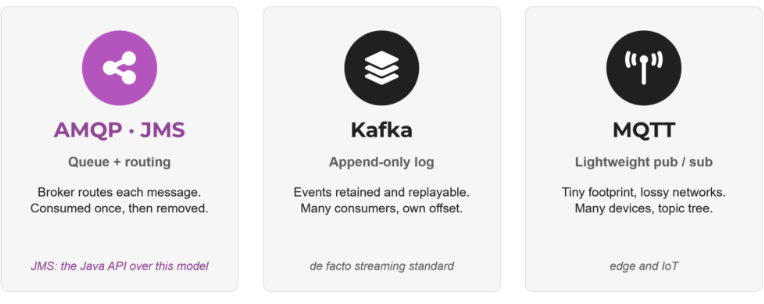
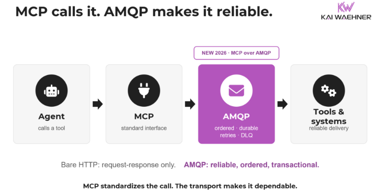

# When to Use AMQP, JMS, Kafka, or MQTT: Trade-offs, Not a Winner

AMQP, JMS, Kafka, and MQTT get lined up as if you pick one and move on. Most of the time that comparison is a category error.

That error is getting easier to make, because the tools now overlap more than they used to. Kafka added queue semantics with Share Groups. RabbitMQ added a log. AMQP's standards committee reconvened after years of quiet, now around agentic AI. MQTT settled into version 5.0 as the default at the edge. JMS, the mature exception, sits still because it already works. The tools are borrowing each other's features. The models underneath, and the trade-offs that come with them, have not merged.

## What are AMQP, JMS, Kafka, and MQTT?

Four short definitions before the comparison, since half the confusion comes from mixing up what each one actually is.

### What is AMQP?

AMQP (Advanced Message Queuing Protocol) is a wire-level protocol for reliable messaging between business applications. It defines the bytes on the network, not a programming interface, so any compliant client can talk to any compliant broker regardless of language.

It is an OASIS standard and ISO/IEC 19464, originally created at JPMorgan to standardize financial messaging. One point trips up nearly every comparison: AMQP 0.9.1 and AMQP 1.0 are different, wire-incompatible protocols. Classic RabbitMQ made 0.9.1 ubiquitous, while enterprise brokers like Azure Service Bus and IBM MQ use 1.0. RabbitMQ has supported 1.0 natively since version 4.0.

### What is JMS?

JMS (Java Message Service, now Jakarta Messaging) is a Java API, not a wire protocol. It standardizes how Java code sends and receives messages, not the bytes that travel between systems, so the transport underneath is the provider's to decide. That is why JMS can run over AMQP or a vendor's own protocol without the application noticing.

JMS is mature and stable rather than fast-moving, and it remains the default messaging abstraction across large Java and Jakarta EE environments. In theory that means you can swap one JMS provider for another, but in practice vendors like IBM and Oracle add proprietary extensions and each ships its own wire protocol underneath, so replacing a provider is a migration, not a drop-in switch.

### What is Kafka?

Apache Kafka is a distributed platform built around a durable, append-only commit log. Producers append events, and many consumers read at their own pace by tracking offsets, so data is retained and replayable rather than deleted on consumption. Because events are stored rather than removed on consumption, producers and consumers are fully decoupled in time: a consumer can join later, replay history, or fall behind and catch up, and new consumers can read the same events without the producer knowing.

A traditional message broker works differently, deleting a message once it is delivered, which couples the two sides in time. Kafka is the de facto standard for event streaming, governed by the Apache project rather than a formal standards body. It scales to very high throughput and, with Queues for Kafka (QfK), now supports queue-style consumption as well.

### What is MQTT?

MQTT, which began as MQ Telemetry Transport, is a lightweight publish/subscribe wire protocol for constrained devices and unreliable networks. It is an OASIS standard and ISO/IEC 20922. Its design center is IoT and edge telemetry: small footprint, low bandwidth, many connections. Version 5.0 added shared subscriptions, richer metadata, and better error reporting.

## How AMQP, JMS, Kafka, and MQTT actually differ

AMQP, JMS, Kafka, and MQTT appear in the same sentence constantly, but they do not sit on the same axis. One is an API. Two are general messaging protocols with different models. One is a device protocol. Treating them as rivals hides the distinctions that matter.

Four technologies, three different models. That is why lining them up as interchangeable is a category error.

Each comparison below pairs AMQP with one of the others, because AMQP is the general-purpose enterprise messaging wire protocol and each of the rest diverges from it on a different axis. Each starts with the category error, then the useful distinction, then when to reach for which.

### AMQP vs JMS: API or wire protocol?

The category error is treating them as rival messaging systems. They are not on the same layer. JMS is a Java API. AMQP is a language-neutral wire protocol. You can even run JMS over AMQP: Apache Qpid JMS implements the JMS API on top of the AMQP 1.0 wire.

The useful distinction is where each stops. JMS abstracts messaging for Java code but leaves the transport to whichever provider you plug in, so portability ends at the API boundary. AMQP standardizes the transport itself, so a Python producer and a Java consumer interoperate through any compliant broker.

When to reach for which: choose JMS when you live in a Java or Jakarta EE world and want a portable API across providers. Choose AMQP when you need cross-language interoperability or want to decouple from a single vendor's wire protocol. They also combine, and a JMS front end over an AMQP transport is a common enterprise pattern.

### AMQP vs Kafka: queue or log?

The category error is assuming two binary wire protocols must be interchangeable. They share a shape and little else. AMQP message brokers deliver a message to a consumer and remove it, with flexible routing and per-message handling. Kafka keeps an ordered, durable log that consumers read by offset, so the same events can be replayed and read by many independent consumers. Governance differs too. AMQP is a formal ISO standard. Kafka is a de facto standard defined by the Apache project's implementation, which is why compatible engines like Redpanda, WarpStream, and Confluent's Kora reimplement the same protocol rather than a frozen spec.

The name Queues for Kafka (QfK) confuses people. It sounds like Kafka became a message broker. It did not. QfK introduces Share Groups, where each message goes to exactly one consumer, adding queue-style consumption on top of the same log. It is queue semantics layered on Kafka, not a separate queue engine, and it does not make Kafka speak AMQP or replace a broker's routing and transactions.

The wider point is that a message broker and a data streaming platform solve different problems and often run side by side, one for point-to-point messaging and one as the central data hub.

One caveat applies to all four, not just Kafka: strengths tell you where a tool shines, not the only place it belongs. Kafka is the clearest example. Thousands of companies run it as the durable backbone for data integration and operational messaging, often well under a thousand messages per second, and that is a first-class use, not a compromise. The reason is the core, not the throughput: a replicated, persistent log with failover and 24/7 availability, decoupling producers from consumers whether the volume is huge or small. The real trade-off is operational weight. You take on running a distributed platform, so you choose Kafka for that durable, always-on backbone and its ecosystem, not to avoid standing up a simple queue. The logic runs both ways. If IBM MQ already anchors your transactional backends with XA and mainframe integration, that is not something you replace for fashion.

When to reach for which: AMQP for reliable application-to-application messaging, request-reply, complex routing, and transactions. Kafka for streaming, event sourcing, and replay, and equally as a durable, always-on backbone for data integration and operational messaging at any volume.

### AMQP vs MQTT: enterprise core or edge?

The category error is smaller here, because both are open wire protocols and both are OASIS and ISO standards, so people assume they compete across the board. They rarely do. The difference is design center. MQTT is deliberately lightweight, tuned for constrained devices, telemetry, and lossy networks, with tens of thousands of connections. AMQP carries richer enterprise semantics and heavier per-message guarantees.

In practice AMQP and MQTT are complementary. MQTT collects data at the edge, and AMQP or another broker carries it through the enterprise core. That is why the cross-membership between the AMQP and MQTT committees matters. Many environments run both, and alignment helps the architects who combine them. MQTT and Kafka pair the same way in IoT: MQTT moves data off constrained devices over unreliable networks, and Kafka processes and integrates it at scale in the core, rather than one replacing the other.

When to reach for which: MQTT for IoT, device fan-in, and the edge over unreliable links. AMQP for the enterprise messaging tier behind it.

## AMQP vs JMS vs Kafka vs MQTT: comparison table

| Dimension                                | AMQP 1.0                                                         | JMS                                                                    | Kafka                                                                              | MQTT                                                   |
| :--------------------------------------- | :--------------------------------------------------------------- | :--------------------------------------------------------------------- | :--------------------------------------------------------------------------------- | :----------------------------------------------------- |
| **What it is**                           | Wire protocol                                                    | Java API                                                               | Wire protocol and platform                                                         | Wire protocol                                          |
| **Standard / governance**                | OASIS, ISO/IEC 19464                                             | Jakarta EE spec                                                        | Apache project (de facto standard)                                                 | OASIS, ISO/IEC 20922                                   |
| **Core model**                           | Queues, routing, pub/sub                                         | API over a provider                                                    | Distributed append-only log                                                        | Lightweight topic pub/sub                              |
| **Retention / replay**                   | No (consume and remove)                                          | No (consume and remove; provider persistence varies)                   | Yes (retention, replay)                                                            | Last value only (retained message)                     |
| **Delivery guarantee**                   | At-most / at-least-once                                          | At-least / exactly-once (XA), provider-dependent                       | At-least / exactly-once (within Kafka)                                             | At-most / at-least / exactly-once (QoS 0/1/2, per hop) |
| **Language scope**                       | Neutral                                                          | Java-centric                                                           | Neutral                                                                            | Neutral                                                |
| **Throughput profile**                   | Moderate to high                                                 | Low to moderate                                                        | Very high (data volume)                                                            | High (device connections)                              |
| **Typical implementations**              | RabbitMQ 4+, Azure Service Bus, IBM MQ, Solace, ActiveMQ Artemis | IBM MQ, Oracle WebLogic, TIBCO EMS, Solace, ActiveMQ, any JMS provider | Apache Kafka, Confluent, Redpanda, WarpStream, Amazon MSK, Aiven, Azure Event Hubs | Mosquitto, HiveMQ, EMQX, RabbitMQ                      |
| **Best-fit use (a default, not a rule)** | Enterprise app-to-app, interop                                   | Portable Java messaging                                                | Streaming, event sourcing, durable messaging...                                    | IoT, telemetry                                         |

## A note on guarantees and exactness

Delivery guarantees depend heavily on configuration, client libraries, and what happens at the boundary.

MQTT QoS 2 guarantees exactly-once delivery on a single hop between client and broker. AMQP settlement modes give at-most-once and at-least-once, with exactly-once left to application-level deduplication. JMS depends on acknowledgment mode and XA transactions. Kafka achieves exactly-once processing (EOS) within its own platform through idempotent producers, transactional writes, and offset management.
