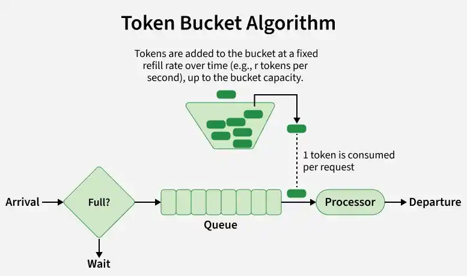

# API Throttling & The Token Bucket Algorithm

## Overview

**API Throttling** is a technique used to control the rate of requests an API receives or processes. While **Rate Limiting** enforces a hard ceiling over a set time window (e.g., 100 requests per minute max, dropping extras with HTTP `429`), **Throttling** dynamically regulates traffic flow to prevent backend systems, databases, and microservices from being overwhelmed during load spikes.

## Rate Limiting vs. Throttling

| Feature               | API Rate Limiting                                   | API Throttling                                                                |
| --------------------- | --------------------------------------------------- | ----------------------------------------------------------------------------- |
| **Primary Goal**      | Prevent abuse/attacks, enforce billing tiers.       | Ensure overall system availability and stability under heavy load.            |
| **Threshold Type**    | Hard limit over fixed or sliding time windows.      | Dynamic limit based on concurrency, server health, or bucket capacity.        |
| **Exceeded Behavior** | Rejects immediately (`HTTP 429 Too Many Requests`). | Delays, queues, degrades service, or rejects when buffer capacity is reached. |
| **Focus**             | Client-centric (per API key, IP, or user).          | System-centric (protecting database connections, CPU utilization, etc.).      |

## Where Throttling is Implemented

1. **API Gateways & Reverse Proxies (Edge Layer):** AWS API Gateway, Kong, NGINX, Cloudflare.

2. **Application Middleware:** Express.js, Spring Boot Filters / Interceptors, ASP.NET Core middleware.

3. **Message Queues (Asynchronous Buffer):** RabbitMQ, Apache Kafka, AWS SQS used for load leveling.

4. **Database / Downstream Layer:** Connection pool management, Envoy service mesh sidecars.

## The Token Bucket Algorithm



The **Token Bucket Algorithm** is one of the most popular algorithms used for both rate limiting and throttling because it allows for short bursts of traffic while ensuring a steady long-term average processing rate.

### How It Works

1. **The Bucket:** A virtual container holds up to a maximum capacity of tokens (`capacity`).

2. **Refill Rate:** Tokens are continuously added to the bucket at a fixed rate (`refill_rate` per second).

3. **Capacity Ceiling:** If the bucket reaches its maximum capacity, new tokens are discarded.

4. **Consuming Tokens:** Every incoming request must acquire a token to be processed.
   - If a token is **available**, it is consumed, and the request proceeds immediately.

   - If **no tokens** are available, the request is either throttled (queued/delayed) or rejected (`HTTP 429`).

## Code Implementations

### 1. Java Implementation

```java
import java.util.concurrent.TimeUnit;

public class TokenBucket {
    private final double capacity;
    private final double refillRatePerSecond;
    private double tokens;
    private long lastRefillNanos;

    /**
     * @param capacity Max capacity of the token bucket.
     * @param refillRatePerSecond Tokens added to the bucket per second.
     */
    public TokenBucket(double capacity, double refillRatePerSecond) {
        this.capacity = capacity;
        this.refillRatePerSecond = refillRatePerSecond;
        this.tokens = capacity;
        this.lastRefillNanos = System.nanoTime();
    }

    private synchronized void refill() {
        long now = System.nanoTime();
        double elapsedSeconds = (now - lastRefillNanos) / 1_000_000_000.0;
        double tokensToAdd = elapsedSeconds * refillRatePerSecond;

        this.tokens = Math.min(capacity, this.tokens + tokensToAdd);
        this.lastRefillNanos = now;
    }

    /**
     * Attempts to consume tokens.
     * @param tokensNeeded Number of tokens required for the request.
     * @return true if allowed, false if throttled.
     */
    public synchronized boolean tryConsume(double tokensNeeded) {
        refill();
        if (this.tokens >= tokensNeeded) {
            this.tokens -= tokensNeeded;
            return true;
        }
        return false;
    }

    public synchronized double getTokensAvailable() {
        refill();
        return this.tokens;
    }

    // --- Usage Example ---
    public static void main(String[] args) throws InterruptedException {
        // Capacity = 5 tokens, Refill = 2 tokens/sec
        TokenBucket bucket = new TokenBucket(5.0, 2.0);

        System.out.println("Simulating 8 rapid requests:");
        for (int i = 1; i <= 8; i++) {
            boolean allowed = bucket.tryConsume(1.0);
            String status = allowed ? "ALLOWED" : "THROTTLED (429)";
            System.out.printf("Request %d: %s | Tokens left: %.2f%n", i, status, bucket.getTokensAvailable());
        }

        System.out.println("\nWaiting for 2 seconds to accumulate tokens...");
        TimeUnit.SECONDS.sleep(2);

        System.out.println("Simulating 3 more requests:");
        for (int i = 9; i <= 11; i++) {
            boolean allowed = bucket.tryConsume(1.0);
            String status = allowed ? "ALLOWED" : "THROTTLED (429)";
            System.out.printf("Request %d: %s | Tokens left: %.2f%n", i, status, bucket.getTokensAvailable());
        }
    }
}
```
