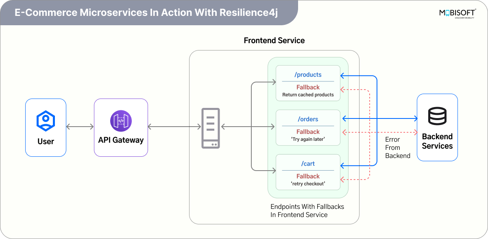

# Resilience4j Circuit Breaker, Retry & Bulkhead Tutorial

https://mobisoftinfotech.com/resources/blog/microservices/resilience4j-circuit-breaker-retry-bulkhead-spring-boot

## Table Of Contents

- Introduction
- Challenges in Microservices
  - Latency Overhead
  - Dependency Failures
- Key Benefits of Resilience Patterns
  - 1. Prevent Cascading Failures
  - 2. Isolate Resource Contention
  - 3. Automatically Recover from Transient Failures
- Key Resilience Patterns
  - Circuit Breaker
  - Retry
  - Bulkhead
- Integrating Resilience4j in a Spring Boot Application
- Frontend Application Setup
- Backend Application Setup
- Testing Resilience Patterns
- Recap of Resilience Patterns Used
- Real-World Benefits of These Patterns
- E-commerce Microservices in Action with Resilience4j
  - Product Service – Circuit Breaker
  - Order Service – Retry
  - Cart Service – Bulkhead
- Conclusion

---

## Introduction

Microservices architecture has become the go-to approach for building scalable, modular, and independently deployable systems. By breaking down a system into smaller, loosely coupled services, teams can innovate faster and scale components independently.

However, while microservices offer clear architectural benefits, they also introduce complexity, particularly around communication between services. These systems depend heavily on network interactions, making them susceptible to latency issues and partial failures.

This is where resilience in microservices becomes essential. Building fault tolerant microservices means anticipating failures and mitigating their impact to ensure system stability and a smooth user experience.

To address these concerns, tools like Resilience4j have emerged. It's a lightweight Java resilience library designed for functional programming and integrates seamlessly with Spring Boot. Resilience4j offers several powerful microservices resilience patterns to improve service-to-service reliability, including the Circuit Breaker pattern, Retry mechanism, and the Bulkhead pattern in microservices.

Tools like Resilience4j align well with efforts focused on modernizing applications with digital transformation, enabling fault-tolerant service design in cloud environments.

For a broader introduction to microservices and their role in modern software architecture, it's essential to understand how they evolved from traditional monolithic systems.

---

## Challenges in Microservices

While monolithic applications operate largely within a single process, microservices rely on distributed communication, usually over HTTP or messaging systems. This introduces new classes of failure that must be accounted for:

### Latency Overhead

In a monolith, method calls are in-process and virtually instantaneous. In microservices, these calls occur over the network, leading to increased latency. Even a small delay in a downstream service can ripple through the system, resulting in cascading latency and degraded user experience.

### Dependency Failures

Each microservice typically depends on one or more downstream services. If a dependent service is slow or unavailable, it can trigger timeouts or exceptions. Left unchecked, this can lead to resource exhaustion, where threads or connections are consumed waiting on failed services, resulting in cascading failures that impact the whole system.

These challenges underscore the need for resilience patterns in Java-based microservices. By integrating techniques such as the Resilience4j Circuit Breaker, Retry pattern in microservices, and Bulkhead pattern, we can significantly enhance the fault tolerance and robustness of our Spring Boot applications.

These practices align closely with core Spring Boot microservices principles that guide scalable, reliable, and maintainable service development.

---

## Key Benefits of Resilience Patterns

### 1. Prevent Cascading Failures

The Circuit Breaker resilience4j implementation stops repeated calls to failing services, protecting the system from overload and minimizing downstream impact.

For example, if a payment service in an e-commerce app is slow, the circuit breaker stops further calls to it temporarily, ensuring the frontend remains responsive and other services aren't affected. This allows the system to degrade gracefully while the failing service recovers.

### 2. Isolate Resource Contention

The bulkhead pattern in microservices ensures that one service or thread pool doesn't monopolize resources, allowing other parts of the system to continue functioning.

For example, if a reporting module starts consuming too many threads, a bulkhead can limit its concurrency, ensuring that core features like order placement in an e-commerce app remain unaffected and responsive.

### 3. Automatically Recover from Transient Failures

The retry pattern in microservices automatically retries failed calls a configured number of times before giving up. It handles transient faults like temporary network issues or backend unavailability.

For example, if a backend service intermittently fails due to a brief timeout or momentary unavailability, retrying the request can often succeed without impacting the user experience. This reduces error rates and improves system reliability without requiring manual intervention, allowing services to self-heal from transient problems.

Combining resilience patterns with DevOps automation and monitoring ensures better observability and proactive failure management across microservices.

---

## Key Resilience Patterns

Modern microservices must anticipate and gracefully handle failure scenarios. Resilience4j examples showcase how the library enables services to recover from latency, failures, and resource bottlenecks using focused resilience patterns in microservices.

The three core patterns, Circuit Breaker, Retry, and Bulkhead, work together to build highly resilient microservices in Java.

---

### Circuit Breaker

#### What is a Circuit Breaker?

The Circuit Breaker pattern in microservices prevents a service from repeatedly calling a failing downstream service. Instead of overwhelming the system with retries or blocking threads, it opens the circuit after a failure threshold is reached. This fail-fast mechanism helps avoid cascading failures and gives failing services time to recover.

#### Why It's Important

- Prevents cascading failures by stopping calls to unhealthy services.
- Helps recover gracefully from transient issues.
- Reduces system load during failure periods.

#### Circuit Breaker States

A Circuit Breaker in Resilience4j transitions through three states to manage backend failures:

1. **Closed**: All requests are allowed through. The circuit breaker monitors failures. If the failure rate exceeds the configured threshold, it opens the circuit.
2. **Open**: All requests are rejected immediately. This state prevents the system from sending load to a failing service. The circuit remains open for the configured wait duration.
3. **Half-Open**: After the wait period, a limited number of requests are allowed through. If they succeed, the circuit closes. If failures continue, the circuit returns to the open state, often with a longer wait period.

This Resilience4j configuration ensures unstable services don't degrade the system and enables automatic recovery without manual intervention.

#### Key Circuit Breaker Configuration Properties in Resilience4j

- **slidingWindowSize**: Defines the number of recent calls considered for failure rate calculation. Default: 100. Example: `slidingWindowSize=5`. Smaller values (e.g., 5) make the circuit breaker more sensitive to recent changes.
- **failureRateThreshold**: Sets the percentage of failed calls required to open the circuit breaker. Default: 50%. Example: `failureRateThreshold=50`. If 50% of recent calls fail, the circuit breaker opens. A higher threshold makes it more lenient.
- **waitDurationInOpenState**: Specifies how long the circuit breaker stays open before transitioning to half-open state. Default: 60 seconds. Example: `waitDurationInOpenState=10s`. After opening, it remains open for the specified time before testing with a limited number of requests.
- **permittedNumberOfCallsInHalfOpenState**: Defines how many calls are allowed in the half-open state to test backend recovery. Default: 10. Example: `permittedNumberOfCallsInHalfOpenState=2`. Fewer calls (e.g., 2) help evaluate if the backend has recovered before returning to a closed state.
- **minimumNumberOfCalls**: Specifies the minimum number of calls before evaluating whether the circuit breaker should open. Default: 100. Example: `minimumNumberOfCalls=5`. Prevents premature opening when there aren't enough calls to assess failure rate.
- **automaticTransitionFromOpenToHalfOpenEnabled**: If true, the circuit breaker automatically transitions from open to half-open state after the wait duration. Default: true. Example: `automaticTransitionFromOpenToHalfOpenEnabled=true`. Disabling this requires manual intervention for state transitions.

---

### Retry

#### What is a Retry Pattern?

Retry is a resilience pattern in microservices used to handle transient faults, temporary glitches such as network hiccups or, a temporarily overloaded service. Instead of failing on the first attempt, it automatically re-attempts the call after a delay, increasing the likelihood of success. This retry pattern in microservices is often implemented using libraries like Resilience4j in Spring Boot.

#### Why It's Important

- Handles intermittent issues that may resolve quickly.
- Improves system robustness without manual retries.
- Helps smooth out temporary spikes in failure rates.

#### Key Retry Configuration Properties in Resilience4j

- **maxAttempts**: Defines the maximum number of attempts for a call, including the initial call plus retries. Default: 3. Example: `maxAttempts=3`. This means the call will be tried up to 3 times before giving up. If the first attempt fails (due to an exception or specific failure conditions), Resilience4j will automatically retry according to the configured policy.
- **waitDuration**: Specifies the fixed wait time between retry attempts. Default: 500ms. Example: `waitDuration=2s`. After a failed call, Resilience4j waits for this duration before trying again. Increasing this delay can help reduce the load on a struggling downstream service and give it time to recover.

To further improve fault tolerance, resilience4j retry supports backoff strategies like exponential or random delays, helping avoid synchronized retries from multiple services that could lead to spikes in load.

> **Best Practice**: Combine Retry with Circuit Breaker. Retry alone may exacerbate failures by increasing load; Circuit Breaker can guard against retry storms.

---

### Bulkhead

#### What is a Bulkhead Pattern?

Inspired by ship design, the bulkhead pattern in microservices limits the number of concurrent requests to a service or resource. Just as watertight compartments prevent an entire ship from sinking, resilience patterns in Java, like bulkheads, prevent failures in one part of a system from cascading.

#### Why it's important

Without bulkheads, a slow or failing dependency can monopolize system resources like threads or database connections, resulting in a complete system outage. The Resilience4j bulkhead pattern helps isolate failures and maintain system responsiveness by limiting the scope of impact.

#### Key Bulkhead Configuration Properties in Resilience4j

- **maxConcurrentCalls**: Defines the maximum number of concurrent calls allowed at any given time. Default: 25. Example: `maxConcurrentCalls=3`.
- **maxWaitDuration**: Specifies how long a call should wait to acquire a permit before being rejected. Default: 0 (no wait). Example: `maxWaitDuration=500ms`.
