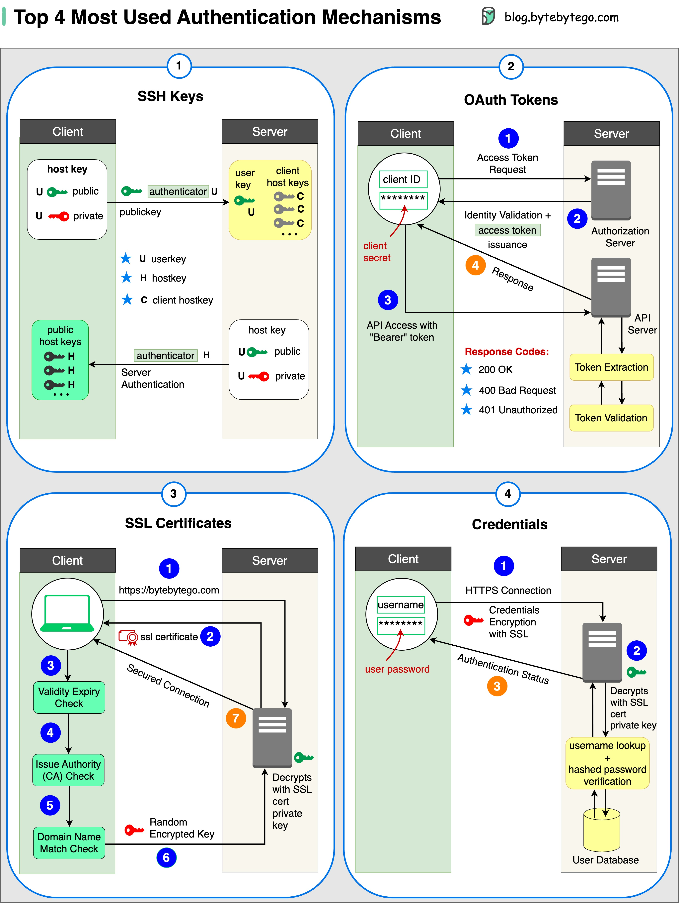

1. SSH Keys
   Cryptographic keys are used to access remote systems and servers securely.

2. OAuth Tokens
   Tokens that provide limited access to user data on third-party applications.

3. SSL Certificates
   Digital certificates ensure secure and encrypted communication between servers and clients.

4. Credentials
   User authentication information is used to verify and grant access to various systems and services.
