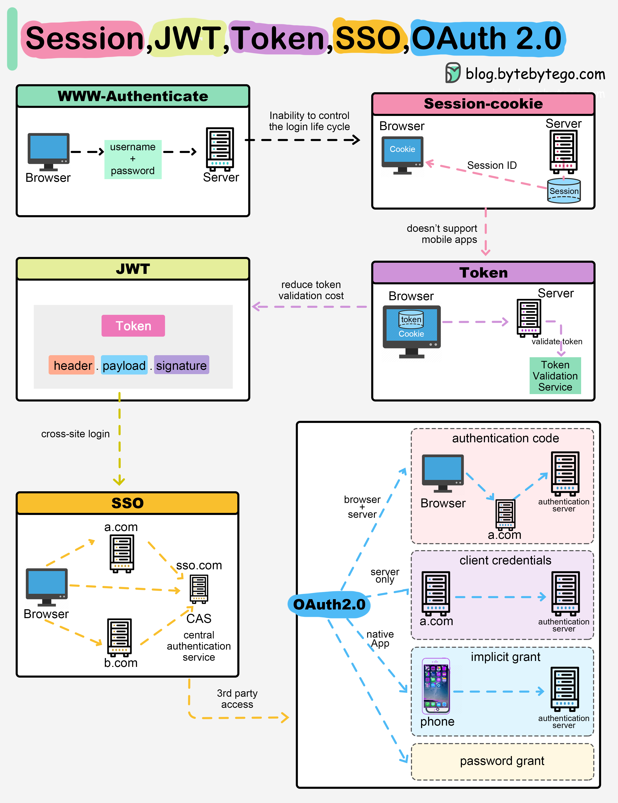

When you login to a website, your identity needs to be managed. Here is how different solutions work:

Session - The server stores your identity and gives the browser a session ID cookie. This allows the server to track login state. But cookies don’t work well across devices.

Token - Your identity is encoded into a token sent to the browser. The browser sends this token on future requests for authentication. No server session storage is required. But tokens need encryption/decryption.

JWT - JSON Web Tokens standardize identity tokens using digital signatures for trust. The signature is contained in the token so no server session is needed.

SSO - Single Sign On uses a central authentication service. This allows a single login to work across multiple sites.

OAuth2 - Allows limited access to your data on one site by another site, without giving away passwords.

QR Code - Encodes a random token into a QR code for mobile login. Scanning the code logs you in without typing a password.

Security in a Java web app usually means three distinct concerns layered on top of each other: authentication (who are you?), authorization (what are you allowed to do?), and delegated access (letting a third party act on your behalf, without handing out your password) — the last one is what OAuth2/OIDC solve. Spring Security is the dominant framework for wiring all three together.



## 1. Authentication vs Authorization — Don't Conflate Them

| Concept        | Question it answers                 | HTTP status on failure |
| -------------- | ----------------------------------- | ---------------------- |
| Authentication | "Who is making this request?"       | 401 Unauthorized       |
| Authorization  | "Is this identity allowed to do X?" | 403 Forbidden          |

A request can be authenticated (valid token, known user) but still forbidden (that user lacks the required role/permission). Getting the status codes right matters — clients and monitoring depend on the distinction.

## 2. Password-Based Authentication Basics

Never store plaintext passwords. Always hash with a slow, salted algorithm designed for passwords (not a general-purpose hash like SHA-256).

```java
@Bean
public PasswordEncoder passwordEncoder() {
    return new BCryptPasswordEncoder(); // salts automatically, tunable cost factor
}

// registration
String hashed = passwordEncoder.encode(rawPassword);
userRepository.save(new User(username, hashed));

// login check
boolean matches = passwordEncoder.matches(rawPassword, storedHash);
```

`BCryptPasswordEncoder` (or `Argon2PasswordEncoder`, generally considered stronger) is the standard choice — never roll your own hashing, and never use `MD5`/`SHA-1`/unsalted `SHA-256` for passwords.

## 3. Spring Security: The Filter Chain

Spring Security intercepts every request through a chain of servlet filters before it reaches your controller. You configure it declaratively:

```java
@Configuration
@EnableWebSecurity
public class SecurityConfig {

    @Bean
    public SecurityFilterChain filterChain(HttpSecurity http) throws Exception {
        http
            .authorizeHttpRequests(auth -> auth
                .requestMatchers("/api/public/**").permitAll()
                .requestMatchers("/api/admin/**").hasRole("ADMIN")
                .anyRequest().authenticated()
            )
            .sessionManagement(session -> session
                .sessionCreationPolicy(SessionCreationPolicy.STATELESS) // typical for token-based APIs
            )
            .oauth2ResourceServer(oauth2 -> oauth2.jwt(Customizer.withDefaults()))
            .csrf(csrf -> csrf.disable()); // safe to disable only for stateless, token-based APIs — never for cookie-based session auth

        return http.build();
    }
}
```

Rule ordering matters: rules are matched top-to-bottom, first match wins — put specific paths before generic `anyRequest()`.

## 4. Authorization: Roles vs Fine-Grained Permissions

```java
// Method-level security — enable once
@EnableMethodSecurity
public class SecurityConfig { }

@Service
public class AccountService {

    @PreAuthorize("hasRole('ADMIN')")
    public void deleteAccount(Long id) { ... }

    @PreAuthorize("#accountId == authentication.principal.accountId or hasRole('ADMIN')")
    public Account getAccount(Long accountId) { ... } // owner OR admin
}
```

- **Roles** (`ROLE_ADMIN`, `ROLE_USER`) are coarse — good for broad access tiers.
- **Permissions/authorities** (`accounts:read`, `accounts:write`) are fine-grained — better when access depends on specific actions or resource ownership, not just a title.

Prefer expressing authorization checks close to the resource (`@PreAuthorize` on the service method) rather than scattering `if (user.isAdmin())` checks through controllers — easier to audit in one place.

## 5. OAuth2: The Core Idea

OAuth2 is a **delegated authorization** protocol: it lets an application access a resource on a user's behalf without ever seeing the user's actual credentials. Key roles:

| Role                 | Example                                                     |
| -------------------- | ----------------------------------------------------------- |
| Resource Owner       | The user                                                    |
| Client               | Your application, requesting access                         |
| Authorization Server | Issues tokens (e.g., Okta, Auth0, Keycloak, Google)         |
| Resource Server      | The API that holds the protected data (validates the token) |

Important distinction: **OAuth2 is about authorization** (access to resources/scopes). **OpenID Connect (OIDC)** is a thin identity layer built on top of OAuth2 that adds actual authentication (the `id_token`, a signed JWT asserting who the user is). If you need "who is this user," you want OIDC, not bare OAuth2.

## 6. OAuth2 Grant Types (Flows)

| Grant Type                         | When to use                                 | Notes                                                                                                    |
| ---------------------------------- | ------------------------------------------- | -------------------------------------------------------------------------------------------------------- |
| Authorization Code (+ PKCE)        | Web/mobile apps with a user present         | The standard, secure default for user-facing login. PKCE is mandatory for public clients (SPAs, mobile). |
| Client Credentials                 | Service-to-service, no user involved        | The client authenticates as itself, gets a token scoped to its own permissions.                          |
| Refresh Token                      | Getting a new access token without re-login | Used alongside the flows above once the initial token is issued.                                         |
| Implicit / Resource Owner Password | Legacy, deprecated                          | Avoid in new systems — both have known security weaknesses.                                              |

Authorization Code flow, simplified:

1. App redirects the user to the Authorization Server's login page.
2. User authenticates there (app never sees the password).
3. Authorization Server redirects back with a short-lived **authorization code**.
4. App exchanges the code (server-side, with a client secret or PKCE verifier) for an **access token** (+ optionally a **refresh token** and, under OIDC, an **id_token**).

## 7. OpenID Connect (OIDC): Adding Identity on Top of OAuth2

OAuth2 alone gives you an access token scoped to resources/permissions, but it says nothing standardized about _who_ actually authenticated — an access token is meant for the resource server to check "is this request allowed," not for the client application to learn "who is logged in right now." OIDC closes that gap: it's a thin, standardized identity layer built on top of OAuth2's Authorization Code flow, adding one new token and a small set of conventions.

### The `id_token`

Requesting the `openid` scope (alongside whatever OAuth2 scopes you'd normally request) tells the Authorization Server to also issue an **`id_token`** — a signed JWT whose entire purpose is asserting identity to the client application, not authorizing API access.

```json
{
  "sub": "user-123",
  "iss": "https://your-auth-server.com/",
  "aud": "your-client-app-id",
  "exp": 1757930400,
  "iat": 1757926800,
  "nonce": "n-0S6_WzA2Mj",
  "email": "user@example.com",
  "email_verified": true,
  "name": "Cosmin"
}
```

Critical distinction, and a common source of security bugs: **the `id_token` is for the client application, the `access_token` is for the resource server** — its `aud` (audience) claim identifies the client app, not your API. Never send an `id_token` as a bearer token to a resource server expecting an OAuth2 `access_token`; a resource server validating tokens should only ever accept properly-scoped access tokens, because the `id_token`'s audience and intended use are entirely different.

### `nonce` — Replay Protection Specific to OIDC

The client generates a random `nonce` value, sends it in the initial authorization request, and then verifies the returned `id_token`'s `nonce` claim matches — this prevents a stolen/replayed `id_token` from a different, unrelated authentication session from being accepted as proof of a fresh login. Spring Security's OIDC client support handles this verification automatically; it's worth knowing it exists specifically because a custom/manual OIDC integration that skips nonce validation reopens exactly this replay gap.

### Discovery and the UserInfo Endpoint

An OIDC-compliant Authorization Server publishes a well-known discovery document so clients don't need to hardcode every endpoint:

```
GET https://your-auth-server.com/.well-known/openid-configuration
```

This returns `authorization_endpoint`, `token_endpoint`, `jwks_uri` (the same signing keys used for JWT validation), `userinfo_endpoint`, and the supported scopes/claims. The **UserInfo endpoint** lets the client fetch additional profile claims about the authenticated subject using the access token — useful when the `id_token` itself was kept minimal and richer profile data (address, phone) wasn't embedded directly in it.

### Spring Security as an OIDC Client ("Login with X")

This is the client-side counterpart to resource-server role — here, your app is the one redirecting users to log in via an external identity provider (Keycloak, Auth0, Okta, Google, Azure AD/Entra ID — all OIDC-compliant).

```yaml
spring:
  security:
    oauth2:
      client:
        registration:
          okta:
            client-id: your-client-id
            client-secret: your-client-secret
            scope: openid, profile, email
        provider:
          okta:
            issuer-uri: https://your-auth-server.com/
```

```java
http.oauth2Login(Customizer.withDefaults()); // enables "Login with Okta" using the OIDC flow end-to-end
```

```java
@GetMapping("/me")
public String me(@AuthenticationPrincipal OidcUser oidcUser) {
    return oidcUser.getFullName() + " <" + oidcUser.getEmail() + ">";
    // Spring already validated the id_token's signature, issuer, audience, expiry, and nonce for you
}
```

Spring's `oauth2Login()` support validates the `id_token` (signature, `iss`, `aud`, `exp`, `nonce`) automatically as part of the login flow — the same JWT validation discipline, applied to the identity token instead of the access token.

## 8. Resource Server: Validating Tokens in Spring

Your API doesn't issue tokens — it just validates them on every request. Spring Security's OAuth2 Resource Server support does this declaratively:

```yaml
# application.yml
spring:
  security:
    oauth2:
      resourceserver:
        jwt:
          issuer-uri: https://your-auth-server.com/
```

```java
http.oauth2ResourceServer(oauth2 -> oauth2.jwt(Customizer.withDefaults()));
```

Spring fetches the issuer's public keys (JWKS endpoint), verifies the JWT signature, checks `exp`/`iat`/`iss` claims, and populates the `Authentication` object — your `@PreAuthorize` checks then work against the token's claims/scopes automatically.

## 9. JWTs: What's Actually Inside

A JWT is three base64url segments: `header.payload.signature`. The payload (claims) is **not encrypted** — anyone can decode and read it, they just can't forge the signature without the signing key.

```json
{
  "sub": "user-123",
  "iss": "https://your-auth-server.com/",
  "aud": "your-api",
  "exp": 1757930400,
  "scope": "accounts:read accounts:write"
}
```

Consequences:

- Never put secrets or sensitive PII in a JWT payload — treat it as visible.
- Always validate `exp` (expiry), `iss` (issuer), and `aud` (audience) — an unvalidated `aud` means a token meant for a different API could be replayed against yours.
- Keep access tokens short-lived (minutes); use refresh tokens (longer-lived, revocable) to get new ones.

## 10. Common Vulnerabilities to Avoid

| Vulnerability                                              | Mitigation                                                                                                                                                  |
| ---------------------------------------------------------- | ----------------------------------------------------------------------------------------------------------------------------------------------------------- |
| Storing tokens in `localStorage` (XSS-exposed)             | Prefer `HttpOnly` cookies for browser apps, or in-memory storage with short token lifetimes.                                                                |
| Missing CSRF protection on cookie-based sessions           | Enable Spring Security's CSRF protection whenever using cookie/session auth — only disable for stateless, token-header-based APIs.                          |
| Broken object-level authorization (BOLA/IDOR)              | Always check the caller owns/can-access the specific resource ID in the URL, not just that they're authenticated.                                           |
| Overly broad scopes                                        | Request and grant the minimum scopes needed (principle of least privilege).                                                                                 |
| Trusting client-supplied roles/claims without verification | Only trust claims from a token you've cryptographically verified — never accept a role from a request body/header unchecked.                                |
| Accepting an `id_token` as if it were an `access_token`    | Its audience is the client app, not your API — a resource server should only validate properly-scoped access tokens.                                        |
| Skipping `nonce` validation in a custom OIDC integration   | Reopens replay of a stolen `id_token` from an unrelated session — Spring's `oauth2Login()` handles this automatically; don't skip it in a hand-rolled flow. |

## 11. Best Practices

| Practice                                                                  | Recommendation                                                                                                                                                     |
| ------------------------------------------------------------------------- | ------------------------------------------------------------------------------------------------------------------------------------------------------------------ |
| Hash passwords with BCrypt/Argon2                                         | Never plaintext, never a fast general-purpose hash.                                                                                                                |
| Use Authorization Code + PKCE for user login                              | The secure default for both web and mobile/SPA clients.                                                                                                            |
| Keep access tokens short-lived                                            | Minutes, not days — pair with refresh tokens for longevity.                                                                                                        |
| Validate `iss`/`aud`/`exp` on every token                                 | Don't just check the signature — an unchecked audience allows token replay across services.                                                                        |
| Authorize at the resource, not just the endpoint                          | Check resource ownership (BOLA/IDOR), not just "is authenticated."                                                                                                 |
| Separate authentication from authorization logic                          | Use OIDC for identity, OAuth2 scopes/roles for access decisions — don't overload one token for both without validating both aspects.                               |
| Use the `id_token` for identity, the `access_token` for API authorization | Never let the two swap roles.                                                                                                                                      |
| Prefer an established OIDC provider over a hand-rolled identity flow      | Keycloak/Auth0/Okta/Entra ID already implement nonce validation, JWKS rotation, and discovery correctly — reinventing this is a common source of subtle auth bugs. |
