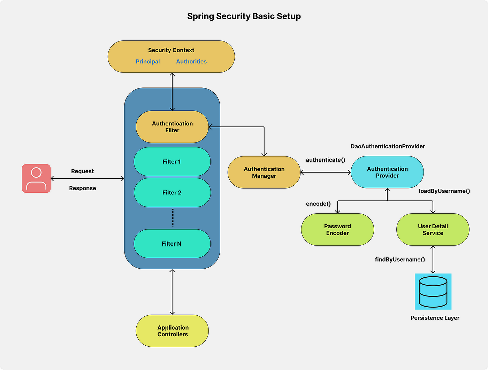

# Spring Security Architectural Components

Spring Security relies on a chain of intercepting filters and context-aware objects to handle two fundamental tasks:

- **Authentication:** Verifying _who_ a user is.
- **Authorization:** Verifying _what_ a user is allowed to do.

Below is a detailed breakdown of the core components and how they interact.



---

## 1. Request Level Components

### DelegatingFilterProxy

The standard Servlet container (like Tomcat) doesn't know about Spring Beans. The `DelegatingFilterProxy` acts as a bridge between the Servlet container's lifecycle and Spring's ApplicationContext, passing incoming HTTP requests to Spring-managed security filters.

### SecurityFilterChain

A collection of Spring-managed security filters that process requests sequentially. You can configure rules for path matching, CSRF protection, session management, and custom authentication mechanisms within this chain.

**Key built-in filters include:**

- `UsernamePasswordAuthenticationFilter`: Processes form-based logins.
- `BearerTokenAuthenticationFilter` / Custom JWT Filters: Processes token-based requests.
- `ExceptionTranslationFilter`: Catches security exceptions and triggers authentication entry points or access denied handlers.
- `AuthorizationFilter`: Evaluates authorization rules (e.g., `.hasRole('ADMIN')`) before passing the request to the controller.

---

## 2. Authentication Core Components

```
[ Request ]
    │
    ▼
[ SecurityFilterChain ]  ── (Extract Credentials)
    │
    ▼
[ AuthenticationManager ]
    │
    ▼
[ AuthenticationProvider ]
    │
    ├──▶ [ UserDetailsService ] ──▶ Fetch User from DB
    └──▶ [ PasswordEncoder ]    ──▶ Verify Password
    │
    ▼
[ SecurityContextHolder ] ── (Store Authenticated Principal)
```

### Authentication (Object)

An interface representing the current user's security identity within the framework.

- **Unauthenticated:** Contains raw input credentials (e.g., username & plain text password).
- **Authenticated:** Contains verified user details, including `GrantedAuthority` objects representing roles/permissions, cleared sensitive credentials, and the user principal.

### AuthenticationManager & ProviderManager

- **`AuthenticationManager`**: The main API defining how authentication is processed (`authenticate()`).
- **`ProviderManager`**: The default implementation of `AuthenticationManager`. It delegates the task across a list of configured `AuthenticationProvider` instances until one successfully authenticates the request.

### AuthenticationProvider

Performs the actual verification logic for a specific type of credentials:

- **`DaoAuthenticationProvider`**: Authenticates standard username/password against a user store.
- **`JwtAuthenticationProvider`**: Validates JWT signature and claims for stateless REST APIs.
- **`OAuth2LoginAuthenticationProvider`**: Handles OAuth2/OIDC identity provider responses.

---

## 3. User & Password Management

### UserDetailsService

A single-method functional interface (`loadUserByUsername(String username)`) used to retrieve user data from your persistence layer (Database, LDAP, external API). It returns a `UserDetails` object.

### UserDetails

Provides core user information needed by the framework, including:

- Username and password.
- Granted authorities/roles (`GrantedAuthority`).
- Account status flags (enabled, account non-expired, credentials non-expired, account non-locked).

### PasswordEncoder

Responsible for safely hashing and validating passwords. Spring Security enforces the use of adaptive, secure hashing algorithms:

- **`BCryptPasswordEncoder`** (Default standard)
- **`Argon2PasswordEncoder`**
- **`Pbkdf2PasswordEncoder`**

---

## 4. Context & Storage Components

### SecurityContext

Holds the `Authentication` object for the currently authenticated user.

### SecurityContextHolder

The central storage mechanism for the `SecurityContext`. By default, it uses a `ThreadLocal` strategy, meaning the authentication context is automatically available to all methods executing within the same request thread.

**Accessing the current user in code:**

```java
SecurityContext context = SecurityContextHolder.getContext();
Authentication authentication = context.getAuthentication();
String currentUserName = authentication.getName();
```

---

## Summary Table

| Component                    | Responsibility                                                       |
| :--------------------------- | :------------------------------------------------------------------- |
| **`DelegatingFilterProxy`**  | Connects Servlet container to Spring Security context.               |
| **`SecurityFilterChain`**    | Applies sequential security rules and filter processing to requests. |
| **`Authentication`**         | Data object containing credentials, principal, and authorities.      |
| **`AuthenticationManager`**  | High-level orchestrator for processing authentication.               |
| **`AuthenticationProvider`** | Implements specific authentication logic (DAO, JWT, OAuth2).         |
| **`UserDetailsService`**     | Loads user domain data from the database.                            |
| **`PasswordEncoder`**        | Hashes and verifies sensitive user passwords safely.                 |
| **`SecurityContextHolder`**  | Stores the authenticated context for the active thread.              |
