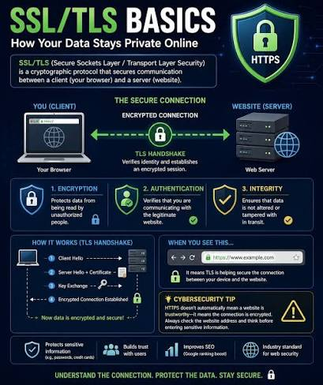
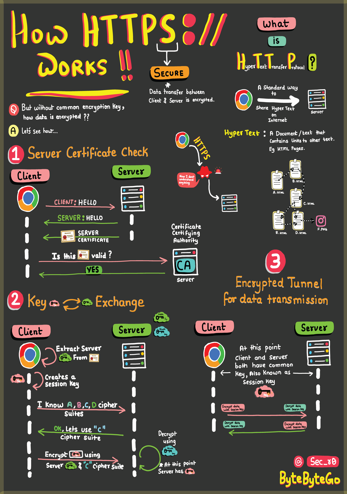

TCP, TLS, and HTTPS are three layers stacked on top of each other, not three competing protocols. TCP gives you a reliable pipe. TLS makes that pipe private and authenticated. HTTPS is just HTTP told to use that private pipe instead of a raw one.

```
TCP handshake (SYN / SYN-ACK / ACK)
   → TLS handshake (certificate check → key exchange → session key established)
       → HTTP request/response, encrypted with the session key
```

## 1. TCP — Reliable Transport

TCP is the transport-layer protocol that guarantees ordered, reliable delivery of bytes between two hosts. It opens with the three-way handshake:

```
Client → SYN     → Server
Client ← SYN/ACK ← Server
Client → ACK     → Server
```

Once complete, both sides have an open, reliable byte stream — but everything sent over it is plaintext. Anyone able to observe the wire can read it. TCP solves _delivery_, not _privacy_.

## 2. SSL/TLS — the Security Layer on Top of TCP



TLS (SSL is its older, deprecated predecessor) sits on top of TCP and adds three guarantees:

| Guarantee      | What it protects against                          |
| -------------- | ------------------------------------------------- |
| Encryption     | An eavesdropper reading the data in transit       |
| Authentication | Talking to an impostor instead of the real server |
| Integrity      | Data being altered or tampered with in transit    |

### The TLS Handshake



1. **Server certificate check** — the client sends a "hello," the server replies with its own "hello" plus its certificate (which contains its public key). The client asks a **Certificate Authority (CA)**: "is this certificate valid?" This step is what stops an attacker from simply handing over their own, self-signed certificate and pretending to be the real server.
2. **Key exchange** — the client extracts the server's public key from the certificate, generates a **session key**, and both sides agree on a cipher suite. The client encrypts key material using the server's public key, so only the server's private key can decrypt it — this is what lets a session key get established safely over a channel that started with zero shared secrets.
3. **Encrypted tunnel** — both sides now hold the same symmetric session key and switch to encrypting/decrypting all real traffic with it.

Asymmetric encryption (public/private key) is only used to bootstrap trust and exchange the session key; the actual bulk data is encrypted with the resulting _symmetric_ session key, because symmetric encryption is far faster for volume.

## 3. HTTPS — HTTP Over a TLS Tunnel

HTTPS is not a separate protocol from HTTP. It's the exact same HTTP — requests, headers, verbs, status codes — sent through an already-established TLS-encrypted connection instead of a raw TCP one. The application layer doesn't change at all; only the transport underneath it is now private and authenticated.

```
https://example.com
   ↑
   the "s" means: this connection is running over a completed TLS handshake
```

Seeing `https://` and a padlock means the connection to that specific server is encrypted — it says nothing about whether the site itself is trustworthy or legitimate. Always still check the actual domain before entering sensitive information.

Encrypts:

- Login details: Usernames and passwords.
- Personal data: Names, addresses, and phone numbers.
- Financial data: Credit card numbers and bank details.
- Page content: The actual text, images, and files you send and receive on a page.
- Web requests: Specific URLs clicked, form data, headers, and cookies.

## 4. Best Practices

| Practice                                                   | Recommendation                                                                                                                         |
| ---------------------------------------------------------- | -------------------------------------------------------------------------------------------------------------------------------------- |
| Never use plain HTTP for anything sensitive                | Without TLS, credentials, tokens, and session cookies travel in plaintext and can be read by anyone on the network path                |
| Validate certificates properly, don't disable verification | Skipping certificate validation (a common "quick fix" in dev) defeats the entire authentication guarantee TLS provides                 |
| Keep TLS versions and cipher suites current                | Older versions (SSL, early TLS) have known vulnerabilities — use current TLS versions and disable weak cipher suites                   |
| Don't confuse "HTTPS" with "trustworthy"                   | HTTPS guarantees the connection is encrypted, not that the site on the other end is legitimate                                         |
| Terminate TLS as close to the client as reasonable         | Internal service-to-service calls still benefit from TLS (mTLS) — don't assume a private network is inherently safe from eavesdropping |
