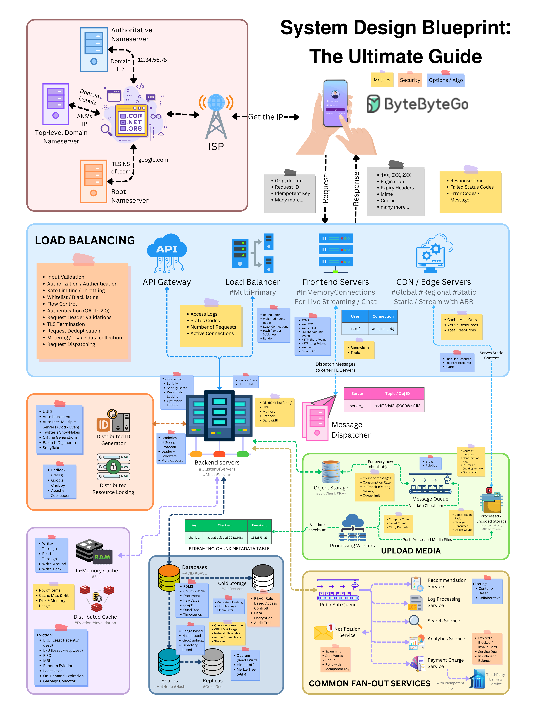

- Load Balancing
- API Gateway
- Communication Protocols
- Content Delivery Network (CDN)
- Database
- Cache
- Message Queue
- Unique ID Generation
- Scalability
- Availability
- Performance
- Security
- Fault Tolerance and Resilience
